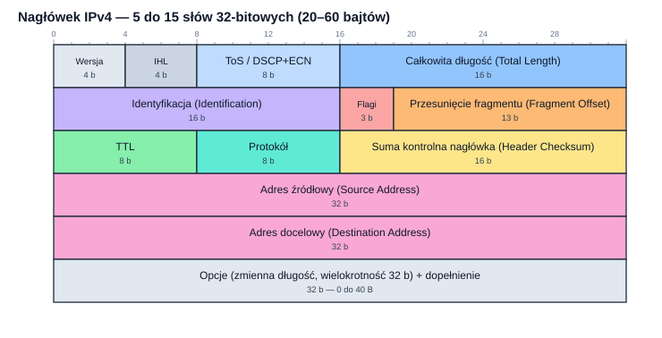
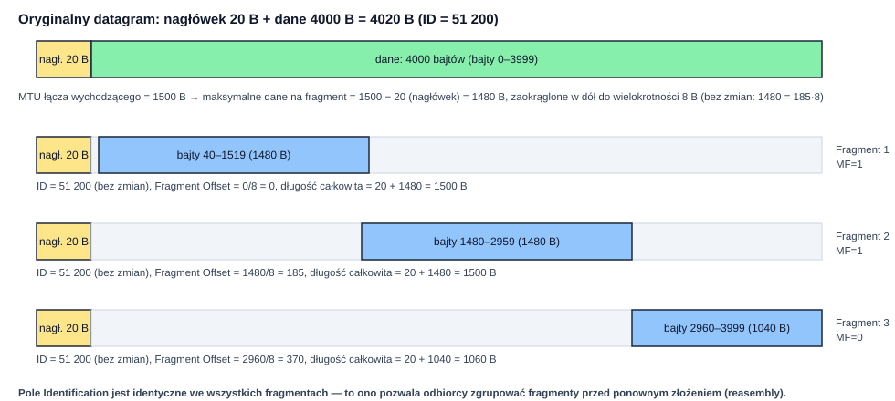
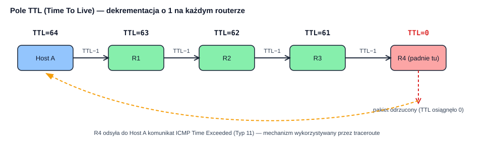
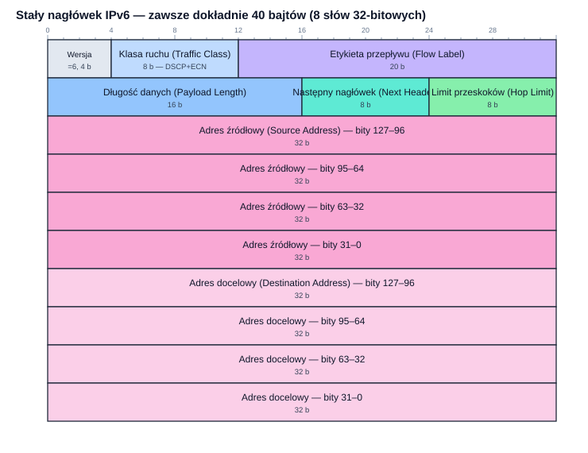

## Wprowadzenie

Warstwa sieciowa (warstwa 3 modelu ISO/OSI) jest miejscem, w którym pojedyncze sieci lokalne — każda ze swoją niezależną adresacją fizyczną, swoim medium transmisyjnym i swoimi urządzeniami warstwy 2 — zostają połączone w jedną, spójną, globalną strukturę: internet. To właśnie tutaj żyje protokół **IP (Internet Protocol)**, będący dosłownie tym „klejem", który sprawia, że ramka wysłana z laptopa w Warszawie może dotrzeć do serwera w Tokio, przechodząc po drodze przez dziesiątki różnych sieci, technologii łącza i administratorów, z których żaden nie musi wiedzieć nic o pozostałych — musi jedynie umieć przekazać pakiet IP o krok bliżej celu.

Ten materiał koncentruje się przede wszystkim na **protokole IPv4** — jego roli, adresacji logicznej oraz drobiazgowej, pole po polu, analizie budowy nagłówka, ze szczególnym naciskiem na mechanizmy IHL, ToS/DiffServ, TTL, fragmentację oraz identyfikację protokołu warstwy wyższej. W dalszej części materiał przedstawia również **protokół IPv6**, jego nagłówek i najważniejsze różnice względem poprzednika, aby całość dawała pełny, porównawczy obraz warstwy sieciowej we współczesnych sieciach.

---

## 1. Rola warstwy sieciowej

### 1.1. Zadania warstwy 3

Warstwa sieciowa odpowiada za dostarczenie danych **od hosta źródłowego do hosta docelowego**, potencjalnie przez wiele pośredniczących sieci, niezależnie od technologii warstwy 2 każdej z nich. Do jej podstawowych zadań należą:

* **adresacja logiczna** — nadanie każdemu urządzeniu w sieci unikalnego, globalnie (lub przynajmniej w obrębie danej sieci) rozpoznawalnego adresu, niezależnego od technologii fizycznej łącza, po którym akurat przemieszcza się dany pakiet;
* **routing (trasowanie)** — wybór ścieżki, którą pakiet powinien pokonać od źródła do celu, przez potencjalnie wiele pośredniczących routerów; realizowany na podstawie tablic routingu budowanych statycznie lub dynamicznie (protokoły takie jak OSPF, BGP — wykraczające poza zakres tego materiału);
* **przekazywanie (forwarding)** — praktyczna, wykonywana „w locie" przez każdy router czynność polegająca na odebraniu pakietu na jednym interfejsie, odczytaniu adresu docelowego, sprawdzeniu go w tablicy routingu i wysłaniu na odpowiedni interfejs wyjściowy;
* **fragmentacja i ponowne składanie danych** — dostosowanie rozmiaru pakietu do maksymalnej jednostki transmisji (MTU) kolejnych łączy na trasie
* **oznaczanie klasy usługi (opcjonalnie)** — możliwość wskazania priorytetu lub wymagań jakościowych pakietu (pole ToS/DiffServ, rozdział 3.3), wykorzystywana przez mechanizmy QoS;
* **kontrola czasu życia pakietu** — zapobieganie nieskończonemu krążeniu pakietów w pętlach routingu.

Co istotne, warstwa sieciowa **nie zajmuje się** niezawodnością dostarczenia (retransmisją utraconych danych), kontrolą przepływu ani zachowaniem kolejności — te zadania, o ile są potrzebne, realizowane są przez warstwę transportową (TCP) lub aplikacje korzystające bezpośrednio z UDP.

### 1.2. Usługa bezpołączeniowa — model best-effort

Protokół IP, zarówno w wersji 4, jak i 6, realizuje **usługę bezpołączeniową (connectionless)**, określaną też mianem **best-effort** (najlepszego możliwego wysiłku, ale bez gwarancji). Oznacza to, że:

* każdy pakiet (zwany w kontekście IP **datagramem**) jest przetwarzany **niezależnie** od poprzednich i kolejnych — router nie utrzymuje żadnego „stanu rozmowy" między dwoma hostami;
* kolejne datagramy tej samej komunikacji **mogą dotrzeć do celu różnymi trasami** i w **innej kolejności**, niż zostały wysłane;
* protokół IP **nie gwarantuje dostarczenia** — datagram może zostać odrzucony (np. z powodu przeciążenia routera, błędu, wygaśnięcia TTL) bez żadnego powiadomienia nadawcy (poza opcjonalnymi komunikatami ICMP);
* **nie ma potwierdzeń ani retransmisji** na poziomie IP — jeśli aplikacja wymaga niezawodności, musi skorzystać z protokołu transportowego TCP, który buduje tę niezawodność na bazie zawodnej usługi IP.

Ten model — prosty, „głupi" rdzeń sieci (routery jedynie przekazują pakiety najlepiej, jak potrafią) i „inteligentne" brzegi (hosty końcowe odpowiadają za niezawodność) — bywa określany zasadą **end-to-end** i jest jedną z fundamentalnych decyzji architektonicznych, które umożliwiły internetowi skalowanie do miliardów urządzeń: routery szkieletowe nie muszą pamiętać nic o pojedynczych połączeniach, co drastycznie upraszcza i przyspiesza ich działanie.

### 1.3. Miejsce IP w stosie protokołów i enkapsulacja

Datagram IP jest przenoszony jako **pole danych (payload)** ramki warstwy 2 (np. ramki Ethernet — patrz materiał o strukturze ramki Ethernet). Z kolei sam datagram IP zawiera w swoim polu danych segment lub datagram warstwy transportowej (TCP lub UDP), a ten z kolei — dane aplikacji. Każda warstwa dokłada swój własny nagłówek, tworząc strukturę „matrioszki":

```bash
Ramka Ethernet [ nagłówek Ethernet [ nagłówek IP [ nagłówek TCP/UDP [ dane aplikacji ] ] ] FCS ]
```

To pole **EtherType** w nagłówku Ethernet (wartość `0x0800` dla IPv4, `0x86DD` dla IPv6) informuje odbiorcę, że zawartość ramki należy przekazać do modułu IP w systemie operacyjnym. Analogicznie, wewnątrz samego datagramu IP pole **Protokół** (rozdział 3.9) pełni dokładnie tę samą funkcję na kolejnym poziomie — wskazuje, do którego protokołu warstwy transportowej należy przekazać zawartość pola danych.

---

## 2. Logiczna adresacja hostów w IPv4

### 2.1. Dlaczego adresacja logiczna, skoro istnieje adres MAC?

Adres MAC (warstwa 2, patrz materiał o strukturze ramki Ethernet) jest przypisany **na stałe do konkretnego interfejsu sieciowego** przez producenta i nie niesie żadnej informacji o **lokalizacji** urządzenia w globalnej strukturze sieci — jest płaski, nie ma hierarchii. Gdyby internet próbował trasować ruch bezpośrednio na podstawie adresów MAC, każdy router szkieletowy musiałby przechowywać w swojej tablicy wpis dla każdego z miliardów urządzeń na świecie — co jest architektonicznie niewykonalne.

**Adres IP** rozwiązuje ten problem, wprowadzając **hierarchiczną, logiczną** strukturę adresacji, przypominającą system pocztowy: podobnie jak adres pocztowy dzieli się na kraj, miasto, ulicę i numer domu, adres IP dzieli się na **część sieciową** (identyfikującą, do której sieci należy host — odpowiednik „miasta") i **część hosta** (identyfikującą konkretne urządzenie w tej sieci — odpowiednik „numeru domu"). Dzięki tej hierarchii router szkieletowy musi znać trasę jedynie do całych **sieci** (agregowanych bloków adresów), a nie do każdego pojedynczego hosta z osobna — co czyni routing skalowalnym.

Kluczowa różnica: adres MAC jest **trwale związany ze sprzętem** (interfejsem sieciowym) i nie zmienia się, gdy urządzenie zmienia lokalizację; adres IP jest **związany z lokalizacją w topologii sieci** i musi się zmienić, gdy urządzenie zostanie przeniesione do innej sieci (chyba że zastosowane zostaną specjalne mechanizmy, jak Mobile IP).

### 2.2. Struktura adresu IPv4

Adres IPv4 to liczba **32-bitowa**, zapisywana dla wygody człowieka w **notacji dziesiętnej kropkowanej (dotted-decimal notation)**: cztery liczby od 0 do 255 (każda reprezentująca jeden 8-bitowy oktet), oddzielone kropkami, np. `192.168.1.10`. W zapisie binarnym: `11000000.10101000.00000001.00001010`.

Adres dzieli się na **prefiks sieciowy (network prefix)** i **identyfikator hosta (host identifier)**. Granica między nimi nie jest zapisana w samym adresie — jest określana osobno, przez **maskę podsieci** lub **notację prefiksową (CIDR)**.

### 2.3. Historyczny podział na klasy adresowe

W pierwotnej specyfikacji IPv4 (RFC 791, 1981) granica między częścią sieciową a hostową była **sztywno ustalona** na podstawie kilku najstarszych bitów adresu — tzw. **klasowy** model adresacji:

| Klasa | Pierwsze bity | Zakres pierwszego oktetu | Domyślna maska | Bity sieci / hosta | Liczba sieci | Hostów na sieć |
|---|---|---|---|---|---|---|
| A | `0` | 1–126 | 255.0.0.0 (/8) | 8 / 24 | 126 | 16 777 214 |
| B | `10` | 128–191 | 255.255.0.0 (/16) | 16 / 16 | 16 384 | 65 534 |
| C | `110` | 192–223 | 255.255.255.0 (/24) | 24 / 8 | 2 097 152 | 254 |
| D (multicast) | `1110` | 224–239 | — nie dotyczy | — | — | — |
| E (zarezerwowana) | `1111` | 240–255 | — eksperymentalna | — | — | — |

*(Adres 127.x.x.x, formalnie należący do klasy A, jest zarezerwowany na potrzeby pętli zwrotnej — patrz rozdział 2.5).*

Podział klasowy okazał się mało elastyczny i marnotrawił przestrzeń adresową: firma potrzebująca 300 adresów musiała otrzymać całą sieć klasy B (65 534 adresów), marnując resztę. Z tego powodu w 1993 roku (RFC 1519) wprowadzono **CIDR**, który klasowy podział praktycznie wyparł — dziś ma on już wyłącznie znaczenie historyczne i edukacyjne, choć terminologia („adres klasy C") bywa wciąż potocznie używana.

### 2.4. CIDR i maska podsieci

**CIDR (Classless Inter-Domain Routing)** pozwala na **dowolne** ustalenie granicy między częścią sieciową a hostową, niezależnie od „klasy" adresu. Granica ta jest wyrażana na dwa równoważne sposoby:

* **maska podsieci (subnet mask)** — 32-bitowa liczba, w której bity ustawione na `1` odpowiadają części sieciowej, a bity `0` — części hosta, np. `255.255.255.0` (binarnie: 24 jedynki, potem 8 zer);
* **notacja prefiksowa (slash notation)** — liczba jedynek w masce zapisana po ukośniku bezpośrednio za adresem, np. `192.168.1.0/24`.

Liczba dostępnych adresów hostów w sieci o prefiksie $/n$ wynosi $2^{32-n}$, przy czym **dwa adresy są zawsze zarezerwowane**: pierwszy (same zera w części hosta) to **adres sieci** (identyfikuje samą sieć jako całość, nie żaden konkretny host), a ostatni (same jedynki w części hosta) to **adres rozgłoszeniowy kierowany (directed broadcast)** tej podsieci. Liczba adresów **użytecznych dla hostów** wynosi zatem $2^{32-n} - 2$.

*Przykład.* Sieć `192.168.1.0/26`: prefiks 26 bitów zostawia $32-26=6$ bitów na hosta, czyli $2^6 = 64$ adresy łącznie, z czego $64-2=62$ adresy użyteczne dla hostów (od `192.168.1.1` do `192.168.1.62`), `192.168.1.0` to adres sieci, a `192.168.1.63` to adres rozgłoszeniowy tej podsieci.

### 2.5. Adresy specjalne i zarezerwowane zakresy

| Zakres / adres | Nazwa | Przeznaczenie |
|---|---|---|
| `0.0.0.0/8` | adres nieokreślony | źródłowy adres hosta, który nie ma jeszcze przydzielonego adresu (np. w trakcie DHCP) |
| `10.0.0.0/8` | prywatny (RFC 1918) | sieci wewnętrzne, niemarszrutyzowane w publicznym internecie |
| `172.16.0.0/12` | prywatny (RFC 1918) | jw. |
| `192.168.0.0/16` | prywatny (RFC 1918) | jw., najpopularniejszy w sieciach domowych |
| `127.0.0.0/8` | pętla zwrotna (loopback) | komunikacja procesu z samym sobą (np. `127.0.0.1`) |
| `169.254.0.0/16` | link-local (APIPA) | automatycznie nadawany, gdy DHCP zawiedzie; ważny tylko w obrębie jednego segmentu |
| `224.0.0.0/4` | multicast | adresowanie grupowe (dawna klasa D) |
| `255.255.255.255` | ograniczony broadcast | rozgłoszenie ograniczone do lokalnego segmentu (nigdy nie routowane dalej) |
| `100.64.0.0/10` | CGN (Carrier-Grade NAT, RFC 6598) | przestrzeń operatorska dla NAT na dużą skalę, np. w sieciach mobilnych |

Adresy prywatne (RFC 1918) mogą być dowolnie wykorzystywane w sieciach wewnętrznych, ponieważ routery szkieletowe internetu **nigdy** nie przekazują pakietów z takimi adresami docelowymi dalej niż do najbliższego routera brzegowego z translacją NAT — to właśnie dzięki temu miliony sieci domowych mogą niezależnie od siebie używać identycznego zakresu `192.168.1.0/24` bez żadnego konfliktu.

### 2.6. Podsieciowanie (subnetting) — przykład praktyczny

**Podsieciowanie** to praktyka dzielenia jednej, większej sieci na mniejsze podsieci poprzez „pożyczenie" części bitów przeznaczonych pierwotnie na hosta i przekazanie ich do części sieciowej (wydłużenie maski/prefiksu).

*Przykład.* Firma otrzymała sieć `192.168.10.0/24` (254 adresy użyteczne) i chce podzielić ją na 4 równe podsieci (np. dla czterech działów). Potrzeba $\log_2 4 = 2$ dodatkowych bitów sieciowych, czyli nowy prefiks to $/26$ ($24+2$):

| Podsieć | Adres sieci | Zakres hostów | Adres rozgłoszeniowy |
|---|---|---|---|
| 1 | 192.168.10.0/26 | .1 – .62 | 192.168.10.63 |
| 2 | 192.168.10.64/26 | .65 – .126 | 192.168.10.127 |
| 3 | 192.168.10.128/26 | .129 – .190 | 192.168.10.191 |
| 4 | 192.168.10.192/26 | .193 – .254 | 192.168.10.255 |

Każda z czterech podsieci mieści $2^6-2=62$ adresy użyteczne dla hostów — łącznie 248 z pierwotnych 254, „stracone" na dodatkowe adresy sieci i broadcastu w każdej podsieci. Jest to typowy kompromis podsieciowania: więcej, mniejszych podsieci oznacza mniej dostępnych adresów hostów, ale lepszą segmentację (patrz materiał o urządzeniach warstwy dostępu, rozdział o segmentacji sieci) i mniejsze domeny rozgłoszeniowe.

---
## 3. Format nagłówka IPv4 — analiza pole po polu

Nagłówek IPv4, opisany w RFC 791, ma **zmienną długość** — od **20 do 60 bajtów** — w zależności od obecności opcjonalnych pól. Składa się z **13 pól obowiązkowych** (mieszczących się w pierwszych pięciu 32-bitowych słowach, czyli 20 bajtach) oraz opcjonalnego pola **Opcje** o zmiennej długości.



Poniżej każde pole omówione jest szczegółowo, w kolejności występowania w nagłówku.

### 3.1. Wersja (Version) — 4 bity

Najstarsze 4 bity pierwszego bajtu nagłówka określają **wersję protokołu IP**. Dla IPv4 pole to zawsze przyjmuje wartość binarną `0100`, czyli dziesiętnie **4**. To właśnie ta wartość pozwala stosowi sieciowemu odbiorcy natychmiast rozpoznać, że ma do czynienia z pakietem IPv4 (w odróżnieniu od IPv6, gdzie to samo pole przyjmuje wartość 6 — patrz rozdział 6.2) i zastosować odpowiedni algorytm parsowania pozostałej części nagłówka, którego struktura różni się diametralnie między obiema wersjami.

### 3.2. Długość nagłówka — IHL (Internet Header Length) — 4 bity

Pole **IHL** określa długość całego nagłówka IPv4, **wyrażoną w jednostkach 32-bitowych słów (4-bajtowych)**, nie w bajtach bezpośrednio. Ponieważ pole ma 4 bity, może przyjąć wartości od 0 do 15, ale w praktyce sensowny zakres to **5 do 15**:

$$\text{Długość nagłówka w bajtach} = \text{IHL} \times 4$$

* **Minimalna wartość IHL = 5**, co odpowiada $5 \times 4 = 20$ bajtom — jest to długość nagłówka **bez żadnych opcji**, obejmująca wyłącznie 13 pól obowiązkowych. Zdecydowana większość ruchu w dzisiejszym internecie korzysta właśnie z tej minimalnej wartości.
* **Maksymalna wartość IHL = 15**, co odpowiada $15 \times 4 = 60$ bajtom — nagłówek z maksymalną dopuszczalną liczbą opcji, zajmujących $60 - 20 = 40$ dodatkowych bajtów.

Dlaczego długość wyrażono w 4-bajtowych słowach, a nie wprost w bajtach? Ponieważ zakres 0–15 (4 bity) wystarcza dokładnie do zaadresowania pełnego zakresu dopuszczalnych długości nagłówka (do 60 B) tylko wtedy, gdy jednostką jest słowo 32-bitowe — bezpośredni zapis w bajtach wymagałby więcej bitów. Jest to również powód, dla którego pole **Opcje** musi być zawsze **dopełnione (padding)** do pełnej wielokrotności 4 bajtów — IHL nie potrafiłby wyrazić długości nagłówka niebędącej wielokrotnością słowa.

Stos sieciowy odbiorcy wykorzystuje wartość IHL do obliczenia, **gdzie dokładnie w pakiecie zaczyna się pole danych** (payload) — jest to pierwsza operacja parsowania po odczytaniu wersji protokołu.

### 3.3. Typ usługi — ToS / DiffServ i ECN — 8 bitów

Ósmy do piętnastego bit nagłówka (drugi bajt) pierwotnie nazywany był **ToS (Type of Service)** i miał, zgodnie z pierwotną specyfikacją RFC 791, umożliwiać nadawcy zasygnalizowanie preferencji dotyczących sposobu obsługi pakietu (np. priorytet, preferencja niskiego opóźnienia kontra wysokiej przepustowości). W praktyce pierwotny format ToS był rzadko wykorzystywany i z czasem został **przedefiniowany**.

#### Format historyczny (RFC 791, dziś nieużywany)

Pierwotnie 8 bitów dzieliło się na: 3-bitowe pole **Precedence** (priorytet, 0–7), oraz pojedyncze bity flag: **D** (Delay — preferencja niskiego opóźnienia), **T** (Throughput — preferencja wysokiej przepustowości), **R** (Reliability — preferencja niezawodności) i 2 bity zarezerwowane.

#### Format współczesny — DiffServ i ECN (RFC 2474, RFC 3168)

Od 1998 roku (RFC 2474) te same 8 bitów zostały **przedefiniowane** na potrzeby architektury **DiffServ (Differentiated Services)**:

* **6 najstarszych bitów** → pole **DSCP (Differentiated Services Code Point)** — pozwala zakwalifikować pakiet do jednej z 64 możliwych klas obsługi (ang. *Per-Hop Behavior*, PHB), na podstawie której routery na trasie mogą różnicować kolejkowanie, priorytetyzację i prawdopodobieństwo odrzucenia pakietu w razie przeciążenia. Popularne, standaryzowane wartości DSCP obejmują m.in.:

| Nazwa PHB | Wartość DSCP (dziesiętnie) | Typowe zastosowanie |
|---|---|---|
| **CS0 (Default)** | 0 | ruch bez gwarancji (best effort) |
| **AF (Assured Forwarding)**, np. AF41 | 34 | ruch wymagający gwarancji, np. wideokonferencje |
| **EF (Expedited Forwarding)** | 46 | ruch o najniższym dopuszczalnym opóźnieniu i jitterze, np. VoIP |
| **CS6 / CS7** | 48 / 56 | ruch sygnalizacyjny sieci (routing, zarządzanie) |

* **2 najmłodsze bity** → pole **ECN (Explicit Congestion Notification, RFC 3168)** — mechanizm pozwalający routerowi **zasygnalizować początek przeciążenia** poprzez ustawienie odpowiednich bitów w przechodzącym pakiecie, **zamiast** jego odrzucenia. Odbiorca odczytuje te bity i informuje nadawcę (poprzez mechanizmy warstwy transportowej, np. nagłówek TCP), który może **proaktywnie zmniejszyć tempo nadawania**, zanim dojdzie do rzeczywistej utraty pakietów. Wartości pola ECN: `00` — end-point nie obsługuje ECN, `10` lub `01` — end-point obsługuje ECN, ale przeciążenia jeszcze nie wykryto, `11` — router na trasie wykrył przeciążenie i oznaczył pakiet (Congestion Experienced).

Ważne rozróżnienie: **DiffServ jest mechanizmem klasyfikacji dla każdego pakietu z osobna** (routery na podstawie DSCP decydują lokalnie, jak obsłużyć dany pakiet — nie ma żadnej rezerwacji zasobów ani gwarancji end-to-end), w odróżnieniu od starszej, znacznie bardziej złożonej architektury **IntServ (Integrated Services)**, która próbowała rezerwować zasoby na całej trasie (protokół RSVP) — podejście to nie zyskało powszechnego zastosowania ze względu na problemy ze skalowalnością w rdzeniu internetu.

### 3.4. Całkowita długość — Total Length — 16 bitów

Pole **Total Length** określa **całkowitą długość całego datagramu IP** (nagłówek **łącznie** z polem danych), wyrażoną **wprost w bajtach** (w odróżnieniu od IHL, które wyrażone jest w słowach). Ponieważ pole ma 16 bitów, maksymalna teoretyczna długość datagramu IPv4 wynosi:

$$2^{16} - 1 = 65\,535 \text{ bajtów}$$

Długość pola danych (payload) oblicza się jako:

$$\text{Długość danych} = \text{Total Length} - (\text{IHL} \times 4)$$

*Przykład.* Datagram o Total Length = 1500 B i IHL = 5 (nagłówek 20 B) niesie $1500 - 20 = 1480$ bajtów danych.

Każde urządzenie warstwy łącza danych ma swoje własne ograniczenie maksymalnej wielkości ramki — **MTU (Maximum Transmission Unit)**, patrz materiał o strukturze ramki Ethernet, gdzie standardowe MTU wynosi 1500 B. Ponieważ 65 535 B znacznie przekracza typowe MTU sieci Ethernet, w praktyce warstwa IP **musi fragmentować** większe datagramy, aby zmieściły się w ramkach warstwy 2 — mechanizm ten jest przedmiotem osobnego, szczegółowego rozdziału 4.

Warto dodać, że mechanizm **Jumbogramów** (RFC 2675) w IPv6 pozwala, w ściśle określonych warunkach sieci wspierających Jumbo Frames, na przesyłanie danych powyżej granicy 65 535 B — nie dotyczy to jednak standardowego IPv4.

### 3.5. Identyfikacja — Identification — 16 bitów

Pole **Identification** zawiera liczbę, którą nadawca przypisuje **każdemu wysyłanemu datagramowi**, typowo inkrementowaną (zwiększaną) dla kolejnych datagramów, choć RFC nie narzuca dokładnego algorytmu jej generowania (współczesne systemy operacyjne z powodów bezpieczeństwa często stosują częściowo losowe wartości, aby utrudnić pewne klasy ataków opierających się na przewidywalności tego pola).

Podstawowa, krytycznie ważna funkcja tego pola ujawnia się w kontekście **fragmentacji**: gdy duży datagram zostaje podzielony na mniejsze fragmenty (bo nie mieści się w MTU kolejnego łącza), **wszystkie fragmenty pochodzące z tego samego, oryginalnego datagramu otrzymują identyczną wartość Identification**. To właśnie ta wspólna wartość pozwala odbiorcy końcowemu — nawet jeśli fragmenty dotrą w różnej kolejności lub wymieszane z fragmentami zupełnie innych datagramów tego samego nadawcy — poprawnie **zgrupować** fragmenty należące do tego samego oryginalnego datagramu przed próbą ich ponownego złożenia (reasembly). Mechanizm ten jest szczegółowo zilustrowany w rozdziale 4.

### 3.6. Flagi — Flags — 3 bity

Trzy bity flag kontrolnych związanych bezpośrednio z mechanizmem fragmentacji:

| Bit | Nazwa | Znaczenie |
|---|---|---|
| bit 0 | **Reserved (zarezerwowany)** | musi zawsze wynosić 0; w niektórych eksperymentalnych zastosowaniach (RFC 3514, żartobliwie nazwany „Evil bit") proponowano wykorzystać go do oznaczania pakietów o złośliwych intencjach — propozycja ta miała charakter satyryczny i nigdy nie została wdrożona |
| bit 1 | **DF (Don't Fragment)** | gdy ustawiony na `1`, **zabrania** routerom na trasie fragmentacji tego datagramu; jeśli datagram z ustawionym DF napotka łącze o MTU mniejszym niż jego rozmiar, zostaje **odrzucony**, a nadawcy zwracany jest komunikat ICMP „Fragmentation Needed" (mechanizm wykorzystywany przez Path MTU Discovery, patrz rozdział 4.5) |
| bit 2 | **MF (More Fragments)** | gdy ustawiony na `1`, oznacza, że **po tym fragmencie nastąpią kolejne** fragmenty tego samego oryginalnego datagramu; wartość `0` oznacza, że jest to **ostatni** fragment (lub że datagram w ogóle nie został pofragmentowany) |

### 3.7. Przesunięcie fragmentu — Fragment Offset — 13 bitów

Pole **Fragment Offset** określa **pozycję danego fragmentu w oryginalnym, niepofragmentowanym datagramie**, wyrażoną — analogicznie do pola IHL — **w jednostkach 8-bajtowych (64-bitowych)**, a nie wprost w bajtach:

$$\text{Pozycja bajtu w oryginalnych danych} = \text{Fragment Offset} \times 8$$

Wybór jednostki 8 bajtów (zamiast np. 1 bajta) wynika z tego samego kompromisu co przy IHL: pole 13-bitowe pozwala zaadresować przesunięcie do $2^{13}-1 = 8191$ jednostek, co przy jednostce 8-bajtowej daje maksymalne przesunięcie $8191 \times 8 = 65\,528$ bajtów — praktycznie pokrywające cały dopuszczalny zakres pola Total Length (65 535 B). Gdyby jednostką był 1 bajt, 13 bitów pozwoliłoby zaadresować jedynie do 8191 B — zbyt mało. Ta sama zależność wymusza regułę: **rozmiar danych każdego fragmentu (poza ostatnim) musi być wielokrotnością 8 bajtów**, ponieważ przesunięcie kolejnego fragmentu musi dać się wyrazić w pełnych jednostkach 8-bajtowych.

Fragment Offset dla **pierwszego** fragmentu (lub dla datagramu niepofragmentowanego) zawsze wynosi **0**. Szczegółowy, w pełni obliczony przykład fragmentacji z wykorzystaniem pól Identification, MF i Fragment Offset znajduje się w rozdziale 4.

---
### 3.8. Czas życia — TTL (Time To Live) — 8 bitów

Pole **TTL** jest omówione szczegółowo w rozdziale 5 — tu krótkie wprowadzenie definicyjne. TTL to 8-bitowy licznik, ustawiany przez nadawcę na pewną wartość początkową (typowo 64, 128 lub 255, zależnie od systemu operacyjnego) i **dekrementowany o co najmniej 1 przez każdy router**, przez który przechodzi datagram. Gdy TTL osiągnie wartość 0, router **odrzuca** datagram i (typowo) odsyła do nadawcy komunikat ICMP Time Exceeded. Mechanizm ten zapobiega nieskończonemu krążeniu pakietów w przypadku błędnej konfiguracji routingu tworzącej pętlę.

### 3.9. Protokół — Protocol — 8 bitów

Pole **Protokół** identyfikuje, **do którego protokołu warstwy wyższej** (typowo warstwy transportowej) należy przekazać zawartość pola danych datagramu po jego dotarciu do hosta docelowego. Pełni dokładnie analogiczną funkcję do pola EtherType w nagłówku Ethernet (patrz materiał o strukturze ramki Ethernet, rozdział 5), tyle że o jeden poziom enkapsulacji wyżej. Wartości tego pola są scentralizowanie zarządzane przez IANA w rejestrze **Protocol Numbers**. Najczęściej spotykane wartości:

| Wartość (dziesiętnie) | Wartość (hex) | Protokół | Opis |
|---|---|---|---|
| 1 | `0x01` | **ICMP** | Internet Control Message Protocol — komunikaty diagnostyczne i błędów |
| 2 | `0x02` | **IGMP** | Internet Group Management Protocol — zarządzanie grupami multicast |
| 6 | `0x06` | **TCP** | Transmission Control Protocol — połączeniowy, niezawodny transport |
| 17 | `0x11` | **UDP** | User Datagram Protocol — bezpołączeniowy, „najlepszego wysiłku" transport |
| 41 | `0x29` | **IPv6** (enkapsulowany) | tunelowanie IPv6 wewnątrz IPv4 (6in4) |
| 47 | `0x2F` | **GRE** | Generic Routing Encapsulation — tunelowanie ogólnego przeznaczenia |
| 50 | `0x32` | **ESP** | Encapsulating Security Payload — część IPsec (szyfrowanie) |
| 51 | `0x33` | **AH** | Authentication Header — część IPsec (uwierzytelnianie integralności) |
| 89 | `0x59` | **OSPF** | Open Shortest Path First — protokół routingu dynamicznego |
| 132 | `0x84` | **SCTP** | Stream Control Transmission Protocol |

Dzięki temu polu stos sieciowy odbiorcy, po zweryfikowaniu, że dany datagram IP jest adresowany do niego (na podstawie adresu docelowego), wie natychmiast, czy przekazać dane do modułu TCP, UDP, ICMP czy innego — bez konieczności „zgadywania" formatu danych zawartych w polu payload.

### 3.10. Suma kontrolna nagłówka — Header Checksum — 16 bitów

Pole **Header Checksum** zawiera 16-bitową sumę kontrolną, obliczaną metodą **dopełnienia do jedynki (one's complement)**, obejmującą **wyłącznie nagłówek IP** (nie obejmuje pola danych — za integralność danych odpowiadają mechanizmy warstw wyższych, np. suma kontrolna TCP/UDP lub FCS warstwy 2).

#### Algorytm obliczania

1. Pole Header Checksum jest **tymczasowo zerowane**.
2. Cały nagłówek traktowany jest jako ciąg **16-bitowych słów**.
3. Wszystkie słowa są sumowane metodą arytmetyki dopełnienia do jedynki (jeśli podczas dodawania wystąpi przeniesienie poza 16 bitów, jest ono „zawijane" i dodawane z powrotem do wyniku — tzw. *end-around carry*).
4. Wynik sumowania jest **negowany bitowo** (dopełnienie do jedynki całej sumy) i wpisywany do pola Header Checksum.

Odbiorca powtarza tę samą operację na **całym** odebranym nagłówku (tym razem **łącznie** z odebraną wartością pola Header Checksum, bez jej zerowania) — jeśli nagłówek nie został uszkodzony, wynik sumowania powinien dać w rezultacie same jedynki binarne (`0xFFFF`). Dowolna inna wartość oznacza wykryty błąd, a pakiet jest po cichu odrzucany.

*Uproszczony przykład liczbowy.* Rozważmy nagłówek złożony (dla uproszczenia) z zaledwie czterech słów 16-bitowych, z polem checksum wyzerowanym:

$$\text{Słowo 1} = \texttt{4500}_{16}, \quad \text{Słowo 2} = \texttt{003C}_{16}, \quad \text{Słowo 3} = \texttt{1C46}_{16}, \quad \text{Słowo 4} = \texttt{4000}_{16}$$

Suma: $\texttt{4500} + \texttt{003C} + \texttt{1C46} + \texttt{4000} = \texttt{5F82}_{16}$ (bez przeniesienia poza 16 bitów w tym przykładzie). Dopełnienie do jedynki (negacja bitowa) tej sumy: $\overline{\texttt{5F82}} = \texttt{A07D}_{16}$ — to właśnie ta wartość zostałaby wpisana do pola Header Checksum. Weryfikacja: odbiorca zsumowałby cztery oryginalne słowa **oraz** wartość checksum $\texttt{A07D}$: $\texttt{5F82} + \texttt{A07D} = \texttt{FFFF}_{16}$ — same jedynki, co potwierdza brak wykrytych błędów.

#### Dlaczego checksum musi być przeliczana na każdym routerze

Ponieważ pole **TTL** jest dekrementowane na każdym routerze na trasie (rozdział 5), a TTL jest częścią nagłówka objętą sumą kontrolną, **każdy router musi przeliczyć Header Checksum od nowa** po zmodyfikowaniu TTL — w przeciwnym razie suma kontrolna przestałaby się zgadzać u kolejnego odbiorcy. Z powodów wydajnościowych routery zwykle nie liczą całej sumy od zera, lecz stosują **przyrostową aktualizację** (RFC 1624) — matematyczną sztuczkę pozwalającą obliczyć nową sumę kontrolną na podstawie starej wartości i wyłącznie zmienionego pola (TTL), bez konieczności ponownego sumowania całego nagłówka.

**IPv6, dla porównania, całkowicie rezygnuje z sumy kontrolnej nagłówka** (rozdział 6) — decyzja ta, choć może się wydawać zaskakująca, jest świadomym wyborem projektowym uzasadnionym w rozdziale 6.3.

### 3.11. Adres źródłowy i adres docelowy — po 32 bity

Dwa pola po 32 bity każde, zawierające adresy IPv4 nadawcy i odbiorcy datagramu, opisane szczegółowo w rozdziale 2. To one — wraz z polem Protokół i portami warstwy transportowej — jednoznacznie identyfikują konkretną „rozmowę" sieciową (tzw. **5-tuple**: adres źródłowy, port źródłowy, adres docelowy, port docelowy, protokół), wykorzystywaną m.in. przez tablice stanu zapór sieciowych (firewalli) i urządzeń NAT.

### 3.12. Opcje i dopełnienie — Options and Padding

Pole **Opcje** jest **opcjonalne** (stąd nazwa) i o **zmiennej długości**, wykorzystywane rzadko we współczesnym ruchu internetowym — w praktyce wiele urządzeń brzegowych i zapór sieciowych domyślnie odrzuca pakiety z niestandardowymi opcjami ze względów bezpieczeństwa (potencjalny wektor ataku lub obejścia filtracji). Przykładowe historyczne opcje obejmują:

* **Record Route** — każdy router na trasie dopisuje swój adres IP, pozwalając nadawcy prześledzić dokładną trasę pakietu (ograniczone praktyczne zastosowanie ze względu na niewielki dostępny rozmiar pola);
* **Timestamp** — podobnie, routery dopisują znaczniki czasu przejścia;
* **Strict/Loose Source Routing** — nadawca narzuca (ściśle lub „luźno") konkretną trasę pakietu przez wskazane routery, z pominięciem standardowego routingu; mechanizm ten jest dziś powszechnie blokowany ze względów bezpieczeństwa (mógłby posłużyć do obejścia list kontroli dostępu).

Ponieważ pole IHL wyraża długość nagłówka w pełnych 4-bajtowych słowach (rozdział 3.2), a Opcje mogą mieć dowolną długość w bajtach, po polu Opcje dodaje się **Padding** — bajty o wartości zero — tak, aby cały nagłówek (13 pól obowiązkowych plus Opcje plus Padding) zawsze kończył się dokładnie na granicy 32-bitowego słowa.

---

## 4. Fragmentacja IPv4 — dogłębna analiza

### 4.1. Przyczyna fragmentacji

Fragmentacja jest konieczna, gdy datagram IP, przekazywany przez router na kolejne łącze, jest **większy niż MTU tego łącza**. Klasyczny scenariusz: dane pochodzą z sieci o dużym MTU (np. niektóre sieci wewnętrzne czy tunele obsługujące Jumbo Frames) i trafiają na standardowy segment Ethernet o MTU 1500 B. Router na granicy tych sieci musi wtedy **podzielić** zbyt duży datagram na mniejsze **fragmenty**, z których każdy zmieści się w MTU łącza wyjściowego.

### 4.2. Zasady konstruowania fragmentów

Każdy fragment jest **samodzielnym, w pełni poprawnym datagramem IP** — otrzymuje własny, kompletny nagłówek (skopiowany w większości pól z oryginału, ale ze zmodyfikowanymi polami Total Length, Flags, Fragment Offset oraz przeliczoną Header Checksum). Reguły konstruowania:

1. **Pole Identification** jest identyczne we wszystkich fragmentach pochodzących z tego samego oryginalnego datagramu — to klucz grupujący przy ponownym składaniu.
2. **Pole Fragment Offset** określa pozycję danych tego fragmentu w oryginalnym datagramie, w jednostkach 8-bajtowych (rozdział 3.7).
3. **Pole MF (More Fragments)** ustawione na `1` we wszystkich fragmentach **poza ostatnim**, gdzie wynosi `0`.
4. **Pole DF (Don't Fragment)**, jeśli było ustawione w oryginalnym datagramie, uniemożliwia fragmentację w ogóle — router w takiej sytuacji odrzuca datagram (rozdział 4.5).
5. Rozmiar danych każdego fragmentu (poza ostatnim) musi być **wielokrotnością 8 bajtów**, ze względu na jednostkę pola Fragment Offset.

### 4.3. Przykład obliczeniowy krok po kroku

Rozważmy datagram o **4000 bajtach danych** (plus standardowy 20-bajtowy nagłówek, czyli Total Length = 4020 B), z Identification = 51 200, który musi zostać przesłany przez łącze o **MTU = 1500 B**.

**Krok 1 — obliczenie maksymalnej ilości danych na fragment.** Dostępne miejsce na dane w jednym fragmencie: $1500 - 20 \text{ (nagłówek)} = 1480$ bajtów. Wartość ta musi być zaokrąglona **w dół** do najbliższej wielokrotności 8: $1480 / 8 = 185$ — już jest wielokrotnością 8, więc zaokrąglenie nie zmienia wyniku. Maksymalna ilość danych na fragment: **1480 B**.

**Krok 2 — obliczenie liczby potrzebnych fragmentów.** $\lceil 4000 / 1480 \rceil = \lceil 2{,}70 \rceil = 3$ fragmenty.

**Krok 3 — konstrukcja poszczególnych fragmentów:**



| Fragment | Dane oryginału (bajty) | Rozmiar danych | Fragment Offset (jedn. 8 B) | MF | Total Length fragmentu |
|---|---|---|---|---|---|
| 1 | 0–1479 | 1480 B | $0 / 8 = 0$ | 1 | $20+1480=1500$ B |
| 2 | 1480–2959 | 1480 B | $1480 / 8 = 185$ | 1 | $20+1480=1500$ B |
| 3 | 2960–3999 | 1040 B | $2960 / 8 = 370$ | 0 | $20+1040=1060$ B |

Wszystkie trzy fragmenty niosą identyczną wartość **Identification = 51 200**. Suma rozmiarów danych wszystkich fragmentów: $1480+1480+1040 = 4000$ B — dokładnie zgadza się z rozmiarem oryginalnych danych, co jest naturalnym warunkiem poprawności fragmentacji.

### 4.4. Ponowne składanie fragmentów (Reassembly)

Kluczowa, często pomijana w uproszczonych opisach zasada: **fragmenty są ponownie składane w oryginalny datagram wyłącznie przez hosta docelowego (odbiorcę końcowego)** — **nie** przez routery pośredniczące na trasie. Router, który sam dokonał fragmentacji lub przez który przechodzą fragmenty utworzone wcześniej, po prostu przekazuje każdy fragment dalej jako niezależny datagram, w oparciu wyłącznie o jego adres docelowy — nie interesuje go, że jest to fragment czegokolwiek.

Host docelowy, odbierając fragmenty (identyfikowane przez trójkę: adres źródłowy + adres docelowy + Identification, a niekiedy dodatkowo pole Protokół), umieszcza je w buforze rekonstrukcyjnym, wykorzystując pole **Fragment Offset** do ustalenia właściwej pozycji danych każdego fragmentu, i uznaje odtwarzanie za zakończone, gdy otrzyma fragment z **MF = 0** (ostatni) **oraz** gdy nie ma żadnych „dziur" (brakujących zakresów bajtów) między fragmentem o offset 0 a fragmentem końcowym. Jeśli w rozsądnym czasie (typowo ok. 30–60 sekund, zależnie od implementacji systemu operacyjnego) nie uda się skompletować wszystkich fragmentów — np. jeden z nich zaginął po drodze — **cały** datagram jest odrzucany (nie ma mechanizmu retransmisji pojedynczego brakującego fragmentu na poziomie IP), a bywa wysyłany komunikat ICMP „Time Exceeded — Fragment Reassembly Time Exceeded".

### 4.5. Path MTU Discovery — unikanie fragmentacji w praktyce

Fragmentacja, choć funkcjonalnie poprawna, ma istotne wady wydajnościowe i bywa problematyczna z punktu widzenia bezpieczeństwa (fragmenty bywały historycznie wykorzystywane do obchodzenia zapór sieciowych i systemów IDS/IPS, analizujących zwykle tylko pierwszy fragment z pełnym nagłówkiem warstwy transportowej). Z tych powodów współczesne stosy sieciowe **wolą unikać fragmentacji w ogóle**, stosując mechanizm **Path MTU Discovery (PMTUD, RFC 1191)**:

1. Nadawca ustawia bit **DF (Don't Fragment)** we wszystkich wysyłanych datagramach.
2. Jeśli na trasie datagram napotka router z łączem wyjściowym o mniejszym MTU niż rozmiar datagramu, router — zamiast fragmentować (co i tak byłoby zabronione przez DF) — **odrzuca** datagram i odsyła nadawcy komunikat **ICMP Destination Unreachable, kod 4 (Fragmentation Needed and DF Set)**, zawierający informację o MTU łącza, które spowodowało problem.
3. Nadawca, otrzymawszy ten komunikat, **zmniejsza** rozmiar kolejnych wysyłanych datagramów do tej wartości i próbuje ponownie — proces powtarza się, jeśli na dalszej trasie napotkane zostanie łącze o jeszcze mniejszym MTU, aż do znalezienia najmniejszej wartości MTU na całej trasie (tzw. **Path MTU**).

Mechanizm ten pozwala nadawcy z góry dostosować rozmiar wysyłanych danych do faktycznych możliwości całej trasy, **eliminując potrzebę fragmentacji przez routery pośredniczące** — fragmentacja, jeśli w ogóle występuje, odbywa się już tylko **na hoście źródłowym**, zanim dane w ogóle opuszczą nadawcę (a dokładniej: w praktyce warstwa transportowa, znając Path MTU, po prostu nie generuje segmentów większych niż to uzasadnione, więc fragmentacja IP staje się zbędna niemal całkowicie). Warto zaznaczyć słabość tego mechanizmu: jeśli komunikaty ICMP są blokowane przez pośredniczącą zaporę sieciową (błąd konfiguracji określany jako **PMTUD black hole**), nadawca nigdy nie dowiaduje się o problemie, a jego pakiety są po cichu odrzucane — dlatego dobra praktyka administracyjna zaleca zawsze przepuszczać komunikaty ICMP typu Destination Unreachable.

---

## 5. Pole TTL i zapobieganie pętlom routingu

### 5.1. Problem: co by się stało bez TTL?

W dużej, rozproszonej sieci, zarządzanej przez wielu niezależnych administratorów i wykorzystującej dynamiczne protokoły routingu, **błędy konfiguracji prowadzące do pętli routingu** (sytuacji, w której router A kieruje ruch do routera B, a router B — z powrotem do routera A) są, choć rzadkie, praktycznie nieuniknione w skali całego internetu. Bez żadnego mechanizmu ograniczającego, pakiet uwięziony w takiej pętli krążyłby **w nieskończoność**, bezużytecznie zajmując pasmo i zasoby przetwarzania kolejnych routerów, aż do całkowitego zapchania dotkniętego fragmentu sieci — zjawisko analogiczne do burzy rozgłoszeniowej w warstwie 2 (patrz materiał o urządzeniach warstwy dostępu), lecz występujące w warstwie 3.

### 5.2. Zasada działania TTL

Pole **TTL (Time To Live)**, mimo swojej nazwy sugerującej jednostkę czasu, jest w praktyce **licznikiem przeskoków (hop count)**, a nie licznikiem czasu w sekundach (taka była pierwotna, nigdy w pełni niewdrożona koncepcja z RFC 791, gdzie TTL miał być dekrementowany również w trakcie oczekiwania w kolejce routera, nie tylko przy każdym przeskoku). Zasada działania:

1. Nadawca ustawia TTL na pewną **wartość początkową**, typową dla systemu operacyjnego: **64** (Linux, macOS, większość dystrybucji Unix), **128** (Windows) lub **255** (niektóre starsze systemy i urządzenia sieciowe, np. Cisco IOS).
2. **Każdy router**, przez który przechodzi datagram, **dekrementuje TTL o co najmniej 1** przed dalszym przekazaniem (RFC dopuszcza dekrementację o więcej niż 1, jeśli pakiet oczekiwał w kolejce dłużej niż 1 sekundę, ale w praktyce niemal wszystkie implementacje stosują dokładnie dekrementację o 1 na przeskok).
3. Jeśli po dekrementacji TTL osiągnie wartość **0**, router **odrzuca** datagram (nie przekazuje go dalej) i — o ile nie jest to celowo wyłączone ze względów bezpieczeństwa lub wydajności — odsyła do adresu źródłowego komunikat **ICMP Time Exceeded (Typ 11, Kod 0)**.



### 5.3. TTL jako narzędzie diagnostyczne — mechanizm traceroute

Zjawisko odrzucania pakietu i generowania komunikatu ICMP Time Exceeded po wygaśnięciu TTL jest sprytnie wykorzystywane przez narzędzie diagnostyczne **traceroute** (w Windows: `tracert`) do **odkrywania trasy** pakietów do danego celu, router po routerze:

1. Narzędzie wysyła pierwszy pakiet (zwykle UDP na nietypowy port, ICMP Echo Request lub TCP SYN, zależnie od implementacji i systemu) z **TTL = 1**.
2. Pierwszy router na trasie dekrementuje TTL do 0, odrzuca pakiet i odsyła ICMP Time Exceeded — traceroute odczytuje adres źródłowy tego komunikatu, poznając w ten sposób adres **pierwszego przeskoku (hop)**.
3. Narzędzie wysyła kolejny pakiet z **TTL = 2** — tym razem pierwszy router przepuszcza go dalej (dekrementując do 1), a to **drugi** router w kolejności odrzuca pakiet przy TTL = 0, ujawniając swój adres.
4. Proces powtarza się z rosnącym TTL (3, 4, 5, …), aż pakiet w końcu dotrze do właściwego celu, który — nie mając już czego przekazywać dalej — odpowiada bezpośrednio (typowo komunikatem ICMP Destination Unreachable/Port Unreachable dla sond UDP, lub bezpośrednią odpowiedzią dla ICMP Echo).

W ten elegancki sposób, wykorzystując mechanizm zaprojektowany pierwotnie wyłącznie do zapobiegania pętlom, traceroute odtwarza **pełną listę routerów** na trasie do celu wraz z przybliżonym czasem odpowiedzi każdego z nich (zwykle trzy próby na każdy TTL, dla uśrednienia opóźnienia i wykrycia niestabilności trasy).

### 5.4. Praktyczne konsekwencje wartości początkowej TTL

Analiza wartości TTL w odebranym pakiecie bywa też wykorzystywana (choć zawodnie) do **przybliżonego rozpoznania systemu operacyjnego** nadawcy (tzw. pasywny fingerprinting) — poprzez porównanie **odebranej** wartości TTL z najbliższą typową wartością początkową (64, 128, 255) i policzenie różnicy, można oszacować **liczbę przeskoków** pokonanych przez pakiet, a pośrednio typowa wartość początkowa bywa wskazówką co do rodzaju nadawcy. Metoda ta jest jednak dość zawodna: administratorzy mogą ręcznie zmieniać domyślne wartości TTL, a rzeczywista liczba przeskoków bywa trudna do jednoznacznego oszacowania.

Zbyt **niska** wartość początkowa TTL, ustawiona przez nadawcę, może w skrajnym przypadku spowodować, że pakiet **nigdy nie dotrze do odległego celu**, wygasając po drodze, zanim dotrze do miejsca docelowego — z tego powodu wartości początkowe TTL są dobierane z pewnym zapasem (64 lub 128 przeskoków to znacznie więcej, niż typowa trasa w internecie wymaga — rzeczywiste trasy między hostami na całym świecie liczą zwykle kilkanaście do góra dwudziestu kilku przeskoków).

---
## 6. Warstwa sieciowa a protokół IPv6

### 6.1. Motywacja powstania IPv6

Jak wspomniano w rozdziale 2, 32-bitowa przestrzeń adresowa IPv4 (nieco ponad 4,3 miliarda adresów) okazała się dalece niewystarczająca w obliczu globalnej ekspansji internetu, eksplozji urządzeń mobilnych i internetu rzeczy. Protokół **IPv6**, opisany obecnie w **RFC 8200** (wcześniej RFC 2460 z 1998 r.), został zaprojektowany od podstaw, aby rozwiązać ten problem, a przy okazji — usprawnić i uprościć szereg mechanizmów, które w IPv4 z czasem okazały się niepotrzebnie skomplikowane lub przestarzałe.

### 6.2. Budowa stałego nagłówka IPv6

W przeciwieństwie do nagłówka IPv4, który ma **zmienną** długość (20–60 B, zależnie od obecności opcji — rozdział 3), **stały nagłówek IPv6 ma zawsze dokładnie 40 bajtów** i składa się z zaledwie **8 pól** — znacznie mniej niż 13 pól obowiązkowych IPv4.



| Pole | Rozmiar | Odpowiednik / różnica względem IPv4 |
|---|---|---|
| **Wersja (Version)** | 4 b | jak w IPv4, tu zawsze wartość 6 |
| **Klasa ruchu (Traffic Class)** | 8 b | odpowiednik pola ToS/DiffServ+ECN (rozdział 3.3) — identyczna koncepcja DSCP i ECN, przeniesiona wprost |
| **Etykieta przepływu (Flow Label)** | 20 b | **pole nowe**, nieobecne w IPv4 — pozwala oznaczyć wszystkie pakiety należące do tego samego „przepływu" (np. jednej sesji TCP) tą samą wartością, ułatwiając routerom szybkie, sprzętowe utrzymywanie spójnego traktowania (np. tej samej ścieżki w równoważeniu obciążenia ECMP) bez konieczności analizy portów warstwy transportowej |
| **Długość danych (Payload Length)** | 16 b | odpowiednik Total Length, ale liczy **wyłącznie dane** (bez 40-bajtowego nagłówka stałego), ponieważ ten ma zawsze znaną, stałą długość |
| **Następny nagłówek (Next Header)** | 8 b | odpowiednik pola Protokół (rozdział 3.9), ale pełni też dodatkową rolę — może wskazywać na **nagłówek rozszerzenia** (rozdział 6.4), a nie bezpośrednio na protokół transportowy |
| **Limit przeskoków (Hop Limit)** | 8 b | dokładny odpowiednik TTL (rozdział 5) — inna nazwa, identyczna funkcja: dekrementacja o 1 na każdym routerze, odrzucenie przy 0 |
| **Adres źródłowy** | **128 b** | 4-krotnie dłuższy niż w IPv4 (32 b) |
| **Adres docelowy** | **128 b** | jw. |

**Pól, które zniknęły całkowicie** względem IPv4: IHL (zbędne — nagłówek ma zawsze stałą długość 40 B), Identification/Flags/Fragment Offset (fragmentacja działa inaczej — rozdział 6.5), oraz **Header Checksum** (rozdział 6.3).

### 6.3. Dlaczego IPv6 zrezygnował z sumy kontrolnej nagłówka?

Decyzja o usunięciu pola Header Checksum (obecnego w IPv4, rozdział 3.10) była świadomym wyborem projektowym, uzasadnionym kilkoma argumentami:

* **Redundancja z innymi warstwami.** Ramka warstwy 2 (np. Ethernet) już zawiera własną sumę kontrolną **FCS/CRC-32**, wykrywającą uszkodzenia na poziomie pojedynczego łącza. Protokoły transportowe **TCP i UDP** zawierają własne sumy kontrolne, obejmujące zarówno nagłówek transportowy, jak i dane, a nawet (poprzez tzw. pseudo-nagłówek) kluczowe pola nagłówka IP (adresy źródłowy i docelowy). Suma kontrolna na poziomie IP była więc w dużej mierze **powtórzeniem** zabezpieczenia już zapewnianego przez warstwy sąsiadujące.
* **Koszt wydajnościowy.** Jak wyjaśniono w rozdziale 3.10, obecność sumy kontrolnej w IPv4 wymusza jej **przeliczenie przez każdy router** po każdej modyfikacji nagłówka (w szczególności — dekrementacji TTL/Hop Limit). Przy prędkościach transmisji rzędu dziesiątek i setek gigabitów na sekundę, charakterystycznych dla współczesnych routerów szkieletowych, nawet niewielki koszt obliczeniowy per-pakiet, pomnożony przez miliardy pakietów na sekundę, staje się istotnym obciążeniem. Usunięcie tego wymogu upraszcza i przyspiesza sprzętową implementację przekazywania pakietów.
* **Filozofia end-to-end.** Zgodnie z zasadą end-to-end (rozdział 1.2), odpowiedzialność za integralność danych aplikacji lepiej umiejscowić na brzegach sieci (w protokołach transportowych i aplikacyjnych), a nie duplikować ją niepotrzebnie w każdym pośredniczącym routerze rdzenia sieci.

### 6.4. Nagłówki rozszerzeń (Extension Headers)

Zamiast pojedynczego pola Opcje o zmiennej długości (jak w IPv4, rozdział 3.12), IPv6 wprowadza koncepcję **łańcucha nagłówków rozszerzeń** — dodatkowych, opcjonalnych nagłówków, umieszczanych między stałym nagłówkiem IPv6 a nagłówkiem protokołu warstwy transportowej, połączonych w łańcuch za pomocą pola **Next Header** każdego z nich (każdy nagłówek rozszerzenia, podobnie jak nagłówek stały, zawiera własne pole Next Header wskazujące na kolejny element łańcucha). Do standardowych nagłówków rozszerzeń należą m.in.: **Hop-by-Hop Options**, **Routing** (odpowiednik source routing z IPv4), **Fragment** (patrz niżej), **Authentication Header (AH)** i **Encapsulating Security Payload (ESP)** — te dwa ostatnie współdzielone z mechanizmem IPsec, również dostępnym w IPv4.

Kluczowa zaleta tej architektury: routery pośredniczące na trasie muszą przetwarzać (i mogą efektywnie pominąć) tylko nagłówki, które ich rzeczywiście dotyczą — w typowym przypadku **żadnych** nagłówków rozszerzeń, przechodząc bezpośrednio od stałego nagłówka do przekazania pakietu dalej, bez analizowania opcji przeznaczonych wyłącznie dla hosta docelowego.

### 6.5. Fragmentacja w IPv6 — fundamentalna różnica koncepcyjna

To jedna z najbardziej istotnych różnic architektonicznych między obiema wersjami protokołu. W IPv4 fragmentacji, jak opisano w rozdziale 4, mógł dokonać **dowolny router na trasie**, jeśli napotkał łącze o zbyt małym MTU. **W IPv6 routery pośredniczące nigdy nie fragmentują pakietów.** Fragmentacja, jeśli jest w ogóle konieczna, może zostać wykonana **wyłącznie przez hosta źródłowego**, przed wysłaniem pakietu — a informacja o niej przenoszona jest w osobnym, opcjonalnym **nagłówku rozszerzenia Fragment** (zawierającym pola analogiczne funkcjonalnie do Identification, Fragment Offset i M-flag z IPv4, lecz umieszczone poza stałym nagłówkiem).

Jeśli router IPv6 napotka na trasie pakiet zbyt duży dla łącza wyjściowego, **zawsze** odrzuca go i odsyła nadawcy komunikat **ICMPv6 Packet Too Big (Typ 2)** — dokładny odpowiednik mechanizmu Path MTU Discovery (rozdział 4.5), z tą różnicą, że w IPv6 jest to **jedyny** dostępny sposób obsługi zbyt dużych pakietów (nie istnieje odpowiednik „zwykłej" fragmentacji przez router, obecnej opcjonalnie w IPv4 przy braku bitu DF). Decyzja ta wymusza powszechne stosowanie mechanizmu Path MTU Discovery jako integralnej, obowiązkowej części stosu IPv6, a nie opcjonalnego usprawnienia jak w IPv4.

Dodatkowo IPv6 wprowadza wymóg **minimalnego MTU całej trasy wynoszącego co najmniej 1280 bajtów** — każde łącze obsługujące IPv6 musi zapewniać MTU nie mniejsze niż ta wartość (a jeśli fizyczne łącze ma mniejsze MTU, warstwa 2 musi zapewnić przezroczystą fragmentację/składanie na swoim własnym poziomie, niewidoczną dla IPv6). Gwarantuje to, że host źródłowy zawsze może bezpiecznie wysłać pakiet o rozmiarze do 1280 B bez ryzyka odrzucenia z powodu zbyt małego MTU gdziekolwiek na trasie, nawet bez uprzedniego przeprowadzenia pełnego Path MTU Discovery.

### 6.6. Porównanie kluczowych pól i mechanizmów

| Cecha / pole | IPv4 | IPv6 |
|---|---|---|
| Długość adresu | 32 bity | 128 bitów |
| Długość nagłówka | zmienna, 20–60 B | zawsze 40 B (nagłówek stały) |
| Pole długości nagłówka (IHL) | tak | nie istnieje (długość zawsze stała) |
| Suma kontrolna nagłówka | tak, przeliczana na każdym routerze | **usunięta** |
| Fragmentacja przez routery pośredniczące | dopuszczalna (jeśli brak DF) | **niedopuszczalna** — tylko host źródłowy, przez nagłówek rozszerzenia |
| Minimalne MTU gwarantowane na każdym łączu | brak formalnego wymogu | **1280 B** |
| Opcje | pole Options w nagłówku podstawowym | oddzielny łańcuch nagłówków rozszerzeń |
| Priorytetyzacja ruchu | ToS / DSCP + ECN (8 b) | Traffic Class (8 b) — koncepcyjnie identyczne |
| Identyfikacja przepływu | brak dedykowanego pola | Flow Label (20 b) — pole nowe |
| Licznik przeskoków | TTL (8 b) | Hop Limit (8 b) — identyczna funkcja, inna nazwa |
| Pole wskazujące protokół wyższej warstwy | Protocol (8 b) | Next Header (8 b) — ta sama koncepcja, rozszerzona o łańcuch nagłówków |
| Adresacja rozgłoszeniowa (broadcast) | tak (np. `255.255.255.255`) | **nie istnieje** — zastąpiona przez rozszerzone wykorzystanie multicastu |
| Autokonfiguracja adresu bez serwera | brak (poza link-local APIPA) | **SLAAC** wbudowany w projekt protokołu |

---

## 7. Podsumowanie

Warstwa sieciowa, a w niej protokół IP, stanowi kręgosłup, dzięki któremu miliardy niezależnie zarządzanych, technologicznie odmiennych sieci lokalnych tworzą jedną, spójną całość — internet. Kluczem do tej integracji jest **hierarchiczna adresacja logiczna**, pozwalająca routerom podejmować decyzje na podstawie skalowalnych, agregowanych bloków adresów, zamiast płaskiej listy każdego pojedynczego urządzenia.

Dokładna analiza nagłówka IPv4 — pole IHL określające zmienną długość nagłówka w jednostkach 4-bajtowych, pole ToS przekształcone z czasem w architekturę DiffServ i mechanizm ECN, pole TTL zapobiegające nieskończonym pętlom routingu (i przy okazji umożliwiające działanie narzędzia traceroute), złożony, wieloetapowy mechanizm fragmentacji oparty na współpracy pól Identification, Flags i Fragment Offset, oraz pole Protokół pełniące funkcję „adresu docelowego" w obrębie stosu protokołów hosta — pokazuje, jak wiele przemyślanych, wzajemnie powiązanych decyzji projektowych kryje się w pozornie prostym, 20-bajtowym nagłówku zaprojektowanym w 1981 roku, a wciąż niosącym większość światowego ruchu internetowego.

**IPv6**, projektowany dwie dekady później, z pełną świadomością ograniczeń poprzednika, pokazuje alternatywną filozofię projektową: stały, uproszczony nagłówek zamiast zmiennej długości z polem IHL, rezygnacja z sumy kontrolnej na rzecz zabezpieczeń w warstwach sąsiednich, przeniesienie fragmentacji wyłącznie na hosta źródłowego oraz elastyczny, rozszerzalny łańcuch nagłówków zamiast sztywnego pola Opcje. Obie wersje protokołu, mimo fundamentalnych różnic w szczegółach implementacyjnych, realizują tę samą, wspólną misję warstwy sieciowej: dostarczenie danych od źródła do celu, przez potencjalnie wiele pośredniczących sieci, w modelu bezpołączeniowym, najlepszego możliwego wysiłku.

---

## 8. Słownik podstawowych pojęć

| Pojęcie | Znaczenie |
|---|---|
| **Best-effort** | model usługi bez gwarancji dostarczenia, kolejności czy czasu |
| **CIDR** | bezklasowy routing międzydomenowy — dowolna granica sieć/host wyrażona prefiksem |
| **DiffServ / DSCP** | architektura różnicowania klas obsługi pakietów na podstawie 6-bitowego pola w nagłówku |
| **ECN** | jawne sygnalizowanie przeciążenia bez odrzucania pakietu |
| **Flow Label** | 20-bitowe pole IPv6 identyfikujące przepływ pakietów należących do tej samej sesji |
| **Fragmentacja** | podział zbyt dużego datagramu na mniejsze części dopasowane do MTU łącza |
| **Header Checksum** | suma kontrolna obejmująca wyłącznie nagłówek IPv4, przeliczana na każdym routerze |
| **Hop Limit** | odpowiednik TTL w IPv6 |
| **IHL** | pole określające długość nagłówka IPv4 w jednostkach 4-bajtowych |
| **MTU** | maksymalna jednostka transmisji dopuszczalna na danym łączu |
| **Next Header** | pole IPv6 wskazujące kolejny nagłówek rozszerzenia lub protokół warstwy transportowej |
| **Path MTU Discovery** | mechanizm ustalania najmniejszego MTU na całej trasie, bez fragmentacji przez routery |
| **RFC 1918** | dokument definiujący prywatne, niemarszrutyzowane publicznie zakresy adresów IPv4 |
| **TTL** | licznik przeskoków dekrementowany przez każdy router, zapobiegający pętlom routingu |

---

## 9. Pytania kontrolne i zadania

### Pytania

1. Wyjaśnij, dlaczego adresacja hierarchiczna (jak w IP) jest niezbędna dla skalowalności internetu, w odróżnieniu od płaskiej adresacji MAC.
2. Pole IHL wyraża długość nagłówka w jednostkach 4-bajtowych, a nie wprost w bajtach. Wyjaśnij, dlaczego, oraz oblicz maksymalną długość nagłówka IPv4 w bajtach.
3. Czym różni się dzisiejsza interpretacja 8-bitowego pola ToS (DSCP + ECN) od jego pierwotnego znaczenia z RFC 791? Jaką funkcję pełni każda z tych dwóch nowych części?
4. Opisz krok po kroku, jak router wykorzystuje pola Identification, Flags (MF, DF) i Fragment Offset przy fragmentacji zbyt dużego datagramu.
5. Dlaczego rozmiar danych każdego fragmentu IPv4 (poza ostatnim) musi być wielokrotnością 8 bajtów?
6. Wyjaśnij zasadę działania pola TTL i opisz, w jaki sposób to pole jest wykorzystywane przez narzędzie diagnostyczne traceroute do odkrywania trasy pakietów.
7. Do czego służy pole Protokół w nagłówku IPv4? Podaj przykład sytuacji, w której nieprawidłowa wartość tego pola uniemożliwiłaby poprawne dostarczenie danych do aplikacji.
8. Dlaczego suma kontrolna nagłówka IPv4 musi być przeliczana na każdym routerze na trasie? Jakie są konsekwencje wydajnościowe tego wymogu i jak rozwiązuje ten problem IPv6?
9. Wymień co najmniej cztery różnice między nagłówkiem IPv4 a nagłówkiem IPv6 (poza samą długością adresu) i krótko uzasadnij motywację projektową każdej z nich.
10. Wyjaśnij, na czym polega fundamentalna różnica w podejściu do fragmentacji między IPv4 a IPv6, oraz jaką rolę odgrywa w tym kontekście gwarantowane minimalne MTU 1280 B w IPv6.

### Zadania obliczeniowe

**Zadanie 1.** Datagram IPv4 ma pole Total Length = 5940 B i standardowy nagłówek bez opcji (IHL = 5). Musi zostać przesłany przez łącze o MTU = 1500 B. Oblicz: (a) rozmiar danych oryginalnego datagramu, (b) liczbę wymaganych fragmentów, (c) wartości pól Fragment Offset i MF dla każdego fragmentu.

**Zadanie 2.** Host wysyła pakiet z TTL = 64 do serwera odległego o 11 przeskoków routingu. Jaka wartość TTL zostanie odczytana przez serwer docelowy w odebranym pakiecie? Jaka jest maksymalna liczba dodatkowych przeskoków, jaką mógłby jeszcze pokonać ten pakiet, zanim zostałby odrzucony?

**Zadanie 3.** Sieć `10.20.30.0/23` ma zostać podzielona na 8 równych podsieci. Oblicz nowy prefiks, liczbę adresów użytecznych dla hostów w każdej podsieci oraz podaj adres sieci i adres rozgłoszeniowy trzeciej z kolei podsieci.

### Klucz odpowiedzi do zadań

**Zadanie 1.** (a) Dane = $5940 - 20 = 5920$ B. (b) Maksymalne dane na fragment: $1500-20=1480$ B (już wielokrotność 8). Liczba fragmentów: $\lceil 5920/1480 \rceil = 4$. (c) Fragment 1: offset = 0, dane 0–1479 (1480 B), MF=1. Fragment 2: offset = $1480/8=185$, dane 1480–2959 (1480 B), MF=1. Fragment 3: offset = $2960/8=370$, dane 2960–4439 (1480 B), MF=1. Fragment 4: offset = $4440/8=555$, dane 4440–5919 (1480 B), MF=0. (Suma danych: $1480 \times 4 = 5920$ B — zgadza się).

**Zadanie 2.** Serwer odczyta TTL $= 64 - 11 = \mathbf{53}$. Ponieważ pakiet zostanie odrzucony przy TTL = 0, mógłby jeszcze pokonać maksymalnie **53 dodatkowe przeskoki** (docierając z TTL=1 do dwunastego kolejnego routera), zanim zostałby odrzucony.

**Zadanie 3.** $/23$ ma $32-23=9$ bitów hosta ($2^9=512$ adresów). Podział na 8 podsieci wymaga $\log_2 8 = 3$ dodatkowych bitów sieciowych: nowy prefiks $= 23+3 = \mathbf{/26}$. Adresów łącznie na podsieć: $2^{32-26}=2^6=64$, użytecznych dla hostów: $64-2=\mathbf{62}$. Rozmiar skoku między kolejnymi podsieciami: 64 adresy. Podsieci (licząc od `10.20.30.0/26`): 1. `10.20.30.0/26`, 2. `10.20.30.64/26`, 3. **`10.20.30.128/26`** — adres sieci: **10.20.30.128**, zakres hostów: 10.20.30.129–10.20.30.190, adres rozgłoszeniowy: **10.20.30.191**.