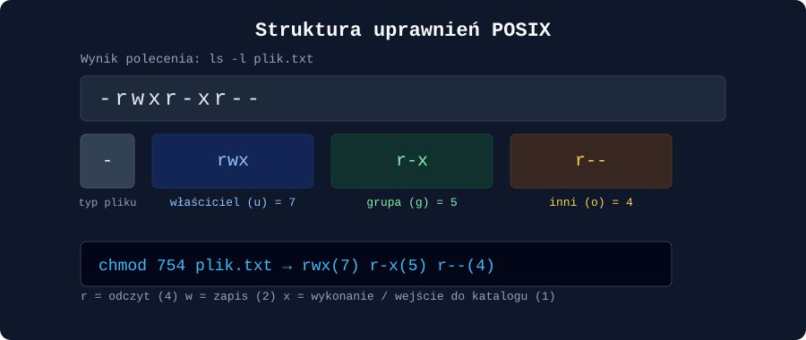
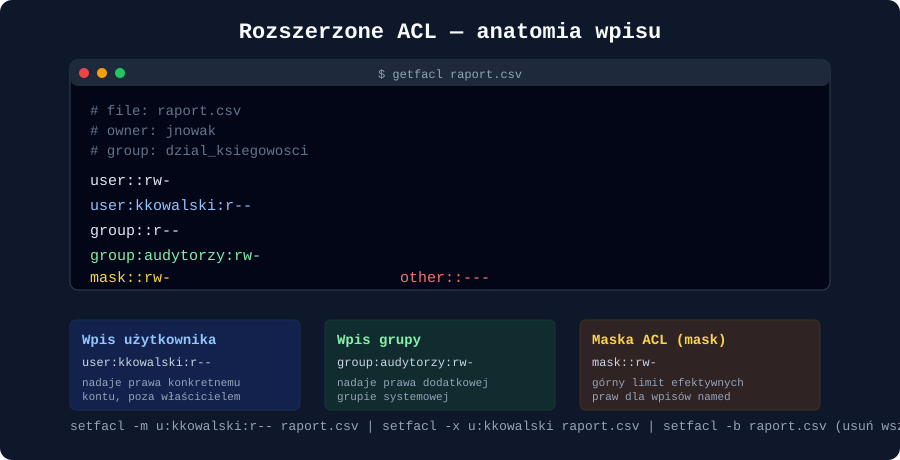
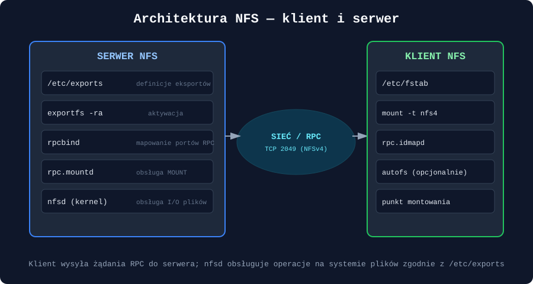

### Uprawnienia POSIX, rozszerzone listy kontroli dostępu (ACL) oraz konfiguracja serwera i klienta NFS w środowiskach uniksowych

---

## Wprowadzenie

Bezpieczeństwo danych w systemach uniksowych i uniksopodobnych (Linux, BSD, Solaris) opiera się na warstwowym modelu kontroli dostępu. Fundamentem jest klasyczny model **POSIX**, prosty i wydajny, ale ograniczony do trzech kategorii podmiotów. Gdy ten model przestaje wystarczać — np. gdy trzeba nadać prawa pojedynczemu użytkownikowi spoza grupy właściciela — z pomocą przychodzą **rozszerzone listy kontroli dostępu (ACL)**. Obie te warstwy uprawnień nabierają dodatkowego znaczenia w środowisku sieciowym, gdzie system plików jest udostępniany przez **NFS (Network File System)** wielu klientom jednocześnie — tam kwestie mapowania użytkowników, synchronizacji identyfikatorów UID/GID i bezpieczeństwa transmisji stają się krytyczne.

Ten artykuł prowadzi przez wszystkie trzy warstwy: od bitów `rwx`, przez `getfacl`/`setfacl`, aż po pełną konfigurację serwera i klienta NFS wraz z diagnostyką.

---

## 1. Model uprawnień POSIX

### 1.1 Podstawowa triada: właściciel, grupa, inni

Każdy plik i katalog w systemie uniksowym posiada trzy zestawy uprawnień przypisane do trzech kategorii podmiotów:

| Kategoria | Symbol | Opis |
|---|---|---|
| Właściciel (`user`) | `u` | Konto, które utworzyło plik lub zostało mu przypisane przez `chown` |
| Grupa (`group`) | `g` | Grupa systemowa powiązana z plikiem |
| Inni (`other`) | `o` | Wszyscy pozostali użytkownicy systemu |

Dla każdej z tych kategorii dostępne są trzy typy uprawnień:

- **r (read, 4)** — odczyt zawartości pliku lub listowanie zawartości katalogu,
- **w (write, 2)** — zapis/modyfikacja pliku lub tworzenie/usuwanie wpisów w katalogu,
- **x (execute, 1)** — uruchomienie pliku jako programu lub wejście do katalogu (`cd`).



Uprawnienia zapisuje się w dwóch notacjach:

- **symbolicznej** — np. `rwxr-xr--`,
- **ósemkowej (oktalnej)** — sumując wagi bitów w każdej triadzie, np. `754`.

```bash
# Odczyt uprawnień
ls -l plik.txt
# -rwxr-xr-- 1 jnowak dzial_it 4096 wrz 18 10:00 plik.txt

# Zmiana uprawnień notacją symboliczną
chmod u+x,g-w,o=r plik.txt

# Zmiana uprawnień notacją ósemkową
chmod 754 plik.txt
```

### 1.2 Bity specjalne: SUID, SGID, sticky bit

Poza podstawową triadą istnieją trzy dodatkowe bity, które modyfikują zachowanie procesów i katalogów:

| Bit | Notacja symboliczna | Wartość ósemkowa | Efekt |
|---|---|---|---|
| **SUID** | `s` w miejscu `x` właściciela | `4000` | Proces uruchamiany jest z uprawnieniami właściciela pliku, a nie użytkownika wywołującego (klasyczny przykład: `/usr/bin/passwd`) |
| **SGID** | `s` w miejscu `x` grupy | `2000` | Na plikach wykonywalnych — proces dziedziczy GID grupy pliku; na katalogach — nowo tworzone pliki dziedziczą grupę katalogu nadrzędnego |
| **Sticky bit** | `t` w miejscu `x` innych | `1000` | Na katalogach (np. `/tmp`) — tylko właściciel pliku (lub root) może go usunąć, nawet jeśli katalog ma prawo zapisu dla wszystkich |

```bash
chmod 2775 /srv/projekty      # SGID + rwxrwxr-x — współdzielony katalog projektowy
chmod 1777 /tmp                # sticky bit — standard dla katalogów tymczasowych
```

> **Uwaga bezpieczeństwa:** binaria z ustawionym SUID/SGID należącym do `root` to jeden z najczęstszych wektorów eskalacji uprawnień. Regularny audyt (`find / -perm -4000 -o -perm -2000`) powinien być elementem higieny bezpieczeństwa serwera.

### 1.3 Ograniczenia modelu POSIX

Model `user/group/other` sprawdza się doskonale dopóki potrzeby dostępu pokrywają się z istniejącą strukturą grup. Problem pojawia się, gdy trzeba np.:

- nadać prawo odczytu jednemu konkretnemu użytkownikowi spoza grupy właściciela, bez zmiany uprawnień dla „innych”,
- nadać różne poziomy dostępu kilku grupom jednocześnie do tego samego zasobu,
- zdefiniować domyślne uprawnienia dziedziczone automatycznie przez nowe pliki w katalogu współdzielonym.

Rozwiązaniem tych ograniczeń są **rozszerzone ACL**.

---

## 2. Rozszerzone listy kontroli dostępu (ACL)

### 2.1 Koncepcja i wymagania systemowe

ACL (Access Control List) w standardzie **POSIX.1e** rozszerza podstawowy model o dowolną liczbę dodatkowych wpisów dla konkretnych użytkowników i grup. System plików musi wspierać ACL — w praktyce ext4, XFS i Btrfs obsługują je natywnie (często wymagając opcji montowania `acl`, choć we współczesnych jądrach Linux jest to zazwyczaj domyślne).

```bash
# Sprawdzenie czy system plików obsługuje ACL
mount | grep acl

# Jeśli trzeba, dopisanie opcji w /etc/fstab
/dev/sda1  /srv  ext4  defaults,acl  0  2
```

Narzędzia do zarządzania ACL znajdują się w pakiecie `acl` (Debian/Ubuntu: `apt install acl`, RHEL/Fedora: `dnf install acl`).

### 2.2 Odczyt ACL: `getfacl`

Polecenie `getfacl` wyświetla pełną listę wpisów kontroli dostępu przypisanych do pliku lub katalogu.

```bash
getfacl raport.csv
```



Przykładowe wyjście:

```bash
# file: raport.csv
# owner: jnowak
# group: dzial_ksiegowosci
user::rw-
user:kkowalski:r--
group::r--
group:audytorzy:rw-
mask::rw-
other::---
```

Kluczowe elementy:

- **`user::`** i **`group::`** bez nazwy — odzwierciedlają klasyczne uprawnienia POSIX właściciela i grupy,
- **`user:nazwa:`** i **`group:nazwa:`** — tzw. wpisy *named entries*, nadające prawa konkretnym kontom lub grupom,
- **`mask::`** — efektywny górny limit uprawnień dla wszystkich wpisów nazwanych (poza właścicielem i „innymi”); nawet jeśli wpis użytkownika mówi `rwx`, maska `r--` ograniczy go do odczytu,
- **`other::`** — analogiczne do klasycznego POSIX.

### 2.3 Modyfikacja ACL: `setfacl`

```bash
# Nadanie prawa odczytu i zapisu konkretnemu użytkownikowi
setfacl -m u:kkowalski:rw- raport.csv

# Nadanie prawa dla grupy
setfacl -m g:audytorzy:r-x katalog_raportow/

# Usunięcie konkretnego wpisu
setfacl -x u:kkowalski raport.csv

# Usunięcie WSZYSTKICH rozszerzonych wpisów (powrót do czystego POSIX)
setfacl -b raport.csv

# Rekursywne nadanie uprawnień w całym drzewie katalogów
setfacl -R -m u:kkowalski:rx katalog_projektu/
```

### 2.4 ACL domyślne (dziedziczone) na katalogach

Jedną z najważniejszych praktycznych funkcji ACL jest możliwość zdefiniowania **domyślnych uprawnień** (`default ACL`), które automatycznie dziedziczą wszystkie nowo tworzone pliki i podkatalogi:

```bash
# Ustawienie domyślnego ACL na katalogu współdzielonym
setfacl -d -m g:dzial_ksiegowosci:rwx /srv/ksiegowosc

# Podgląd — wpisy domyślne oznaczone prefiksem "default:"
getfacl /srv/ksiegowosc
# default:user::rwx
# default:group:dzial_ksiegowosci:rwx
# default:mask::rwx
# default:other::---
```

To rozwiązanie jest kluczowe w środowiskach współdzielonych — bez niego każdy nowy plik wymagałby ręcznego nadania uprawnień.

### 2.5 Kopia zapasowa i przenoszenie ACL

```bash
# Zapis pełnej struktury ACL drzewa katalogów do pliku
getfacl -R /srv/projekty > acl_backup.txt

# Odtworzenie ACL z kopii zapasowej
setfacl --restore=acl_backup.txt
```

Jest to niezbędne przy migracjach danych między serwerami, ponieważ standardowe `cp` czy `tar` bez odpowiednich flag (`--acls`) może pominąć rozszerzone atrybuty.

---

## 3. Sieciowy system plików NFS

### 3.1 Architektura i wersje protokołu

NFS pozwala na udostępnienie katalogu z jednej maszyny (serwera) i zamontowanie go zdalnie na innej (kliencie), tak jakby był lokalnym systemem plików. Protokół opiera się na wywołaniach zdalnych procedur (**RPC — Remote Procedure Call**).



Najważniejsze wersje protokołu:

| Wersja | Charakterystyka |
|---|---|
| **NFSv3** | Bezstanowy, wymaga osobnych usług `rpcbind`, `mountd`, `nlockmgr` (blokady) na kilku portach |
| **NFSv4** | Stanowy, korzysta wyłącznie z **portu TCP 2049**, wbudowana obsługa blokad i delegacji, wsparcie dla **własnych ACL w stylu NFSv4** (zbliżonych do NTFS/Windows) |
| **NFSv4.2** | Dodaje m.in. wsparcie dla operacji `server-side copy`, `sparse files`, silniejszą integrację z etykietami SELinux |

W nowoczesnych wdrożeniach zaleca się domyślne stosowanie **NFSv4** ze względu na uproszczoną architekturę sieciową (jeden port) oraz lepsze bezpieczeństwo.

### 3.2 Konfiguracja serwera NFS

#### Krok 1 — instalacja pakietów

```bash
# Debian/Ubuntu
apt install nfs-kernel-server

# RHEL/Fedora/Rocky
dnf install nfs-utils
```

#### Krok 2 — definicja eksportów w `/etc/exports`

Plik `/etc/exports` określa, które katalogi są udostępniane, dla jakich hostów i z jakimi opcjami:

```bash
/srv/dane        192.168.1.0/24(rw,sync,no_subtree_check)
/srv/publiczne    *(ro,sync,all_squash,anonuid=65534,anongid=65534)
/home             10.0.0.15(rw,sync,no_root_squash,sec=krb5p)
```

Kluczowe opcje eksportu:

| Opcja | Znaczenie |
|---|---|
| `rw` / `ro` | odczyt-zapis / tylko odczyt |
| `sync` / `async` | `sync` potwierdza zapis dopiero po fizycznym zapisaniu na dysku (bezpieczniejsze); `async` — szybsze, ale ryzykowne przy awarii |
| `no_root_squash` | użytkownik `root` klienta zachowuje uprawnienia roota na serwerze (**bardzo niebezpieczne** — używać wyłącznie w zaufanych sieciach) |
| `root_squash` (domyślne) | żądania od `root` klienta są mapowane na konto `nobody` |
| `all_squash` | wszyscy zdalni użytkownicy mapowani są na jedno konto (`anonuid`/`anongid`) — przydatne dla zasobów publicznych |
| `no_subtree_check` | wyłącza dodatkową weryfikację ścieżki, poprawia wydajność i stabilność |
| `sec=sys\|krb5\|krb5i\|krb5p` | metoda uwierzytelniania: `sys` (podstawowa, oparta na UID), `krb5` (Kerberos), `krb5i` (+integralność), `krb5p` (+szyfrowanie) |

#### Krok 3 — aktywacja i usługi

```bash
exportfs -ra              # ponowne wczytanie /etc/exports bez restartu usługi
exportfs -v               # wyświetlenie aktywnych eksportów wraz z opcjami

systemctl enable --now nfs-server
systemctl status nfs-server
```

#### Krok 4 — firewall

```bash
# NFSv4 — wystarczy jeden port
firewall-cmd --permanent --add-service=nfs
firewall-cmd --reload

# NFSv3 — dodatkowo porty rpcbind, mountd, statd (zwykle 111 + zakresy dynamiczne)
firewall-cmd --permanent --add-service=rpc-bind
firewall-cmd --permanent --add-service=mountd
```

### 3.3 Konfiguracja klienta NFS

#### Krok 1 — instalacja narzędzi klienckich

```bash
apt install nfs-common        # Debian/Ubuntu
dnf install nfs-utils          # RHEL/Fedora
```

#### Krok 2 — montowanie ręczne

```bash
mkdir -p /mnt/dane
mount -t nfs4 -o rw,sync serwer.firma.local:/srv/dane /mnt/dane
```

#### Krok 3 — montowanie trwałe przez `/etc/fstab`

```bash
serwer.firma.local:/srv/dane   /mnt/dane   nfs4   rw,sync,_netdev,noatime   0 0
```

Opcja `_netdev` informuje system, że punkt montowania wymaga aktywnej sieci przed próbą montowania — kluczowe przy starcie systemu.

#### Krok 4 — montowanie na żądanie: `autofs`

Dla zasobów używanych sporadycznie lepszym rozwiązaniem jest **autofs**, który montuje katalog dopiero przy pierwszym dostępie i odmontowuje po okresie bezczynności:

```bash
# /etc/auto.master
/mnt/auto   /etc/auto.nfs

# /etc/auto.nfs
dane   -rw,soft,intr   serwer.firma.local:/srv/dane
```

---

## 4. Współdziałanie NFS z uprawnieniami POSIX i ACL

### 4.1 Mapowanie identyfikatorów UID/GID

NFS w wersjach 3 i wcześniejszych przesyła numeryczne identyfikatory UID/GID „na wprost” — jeśli `jnowak` ma UID `1001` na serwerze, a na kliencie UID `1001` należy do zupełnie innego konta, dojdzie do niezamierzonego udostępnienia danych. **Spójność bazy użytkowników (UID/GID) pomiędzy serwerem a klientami jest absolutnym wymogiem** — realizowanym zwykle przez centralne usługi katalogowe (LDAP, FreeIPA, Active Directory + SSSD).

NFSv4 wprowadza dodatkową warstwę — identyfikatory w formie `użytkownik@domena`, tłumaczone przez usługę `rpc.idmapd` (plik konfiguracyjny `/etc/idmapd.conf`). Jeśli domeny NFSv4 na serwerze i kliencie się nie zgadzają, użytkownicy będą widzieć pliki jako należące do `nobody`.

```bash
# /etc/idmapd.conf
[General]
Domain = firma.local
```

### 4.2 ACL POSIX vs. ACL NFSv4

Warto rozróżnić dwa niezależne standardy ACL:

- **ACL POSIX.1e** (opisane w sekcji 2) — obsługiwane lokalnie przez `getfacl`/`setfacl`, propagowane przez NFSv4 tylko częściowo (zależnie od implementacji jądra i przestrzeni nazw),
- **ACL natywne NFSv4** — osobny, bardziej rozbudowany model list kontroli dostępu (podobny do Windows NTFS), z regułami ALLOW/DENY i dziedziczeniem na poziomie protokołu, zarządzany narzędziami `nfs4_getfacl` / `nfs4_setfacl`.

```bash
nfs4_getfacl /mnt/dane/plik.txt
nfs4_setfacl -a A::kkowalski@firma.local:rwaxtcy /mnt/dane/plik.txt
```

Mieszanie obu modeli na tym samym eksporcie bywa źródłem trudnych do zdiagnozowania problemów — w środowiskach jednorodnie linuksowych zwykle prościej jest pozostać przy klasycznym ACL POSIX i `root_squash`/mapowaniu UID, a natywne ACL NFSv4 rezerwować dla środowisk mieszanych z klientami Windows lub macOS.

### 4.3 Squashing a efektywne uprawnienia

Mechanizmy `root_squash`/`all_squash` działają **na poziomie serwera NFS**, niezależnie od lokalnych uprawnień POSIX/ACL pliku. Oznacza to, że nawet jeśli lokalne ACL nadają danemu UID pełne prawa, serwer może i tak zmapować żądanie na `nobody`, jeśli klient łączy się jako `root`, a eksport ma ustawione domyślne `root_squash`. Efektywne uprawnienia to zawsze **iloczyn** ograniczeń: eksportu NFS, uprawnień POSIX/ACL pliku oraz — jeśli aktywny — SELinuksa/AppArmor.

---

## 5. Bezpieczeństwo i utwardzanie konfiguracji

- **Unikaj `no_root_squash`** poza wąsko kontrolowanymi scenariuszami (np. serwery bezdyskowe startujące przez NFS-root) — to najczęstsza przyczyna eskalacji uprawnień przez NFS.
- **Ogranicz eksporty do konkretnych podsieci lub hostów** zamiast używać `*`.
- **Stosuj `sec=krb5p`** tam, gdzie dane są wrażliwe — domyślne `sec=sys` opiera się wyłącznie na zaufaniu do numerów UID przesyłanych przez klienta, bez żadnego uwierzytelnienia kryptograficznego.
- **Nie eksportuj NFS do sieci publicznej** bez VPN lub tunelu — protokół nie był projektowany z myślą o otwartym internecie.
- **Regularnie audytuj ACL** (`getfacl -R` na katalogach wrażliwych) — rozszerzone uprawnienia bywają pomijane przy standardowych przeglądach `ls -l`.
- **Montuj z opcją `nosuid`** na eksportach, gdzie nie jest to potrzebne, aby zapobiec eskalacji przez binaria SUID przyniesione z zewnątrz.

---

## 6. Diagnostyka i rozwiązywanie problemów

| Polecenie | Zastosowanie |
|---|---|
| `showmount -e serwer` | wyświetla listę eksportów dostępnych na zdalnym serwerze |
| `rpcinfo -p serwer` | pokazuje zarejestrowane usługi RPC i ich porty |
| `nfsstat -c` / `nfsstat -s` | statystyki operacji NFS po stronie klienta / serwera |
| `mount -v` | weryfikacja rzeczywiście użytych opcji montowania |
| `exportfs -v` | lista aktywnych eksportów wraz z opcjami na serwerze |
| `dmesg \| grep -i nfs` | komunikaty jądra dotyczące błędów montowania/RPC |
| `getfacl` / `nfs4_getfacl` | weryfikacja rzeczywistych uprawnień widocznych po stronie klienta |

Typowy scenariusz diagnostyczny: użytkownik zgłasza brak dostępu do pliku mimo poprawnych uprawnień lokalnych. Kolejność sprawdzeń powinna wyglądać następująco: (1) czy eksport na serwerze w ogóle obejmuje dany host/sieć — `showmount -e`; (2) czy UID/GID klienta i serwera się zgadzają — `id` po obu stronach; (3) czy nie działa `squash` mapujący żądanie na `nobody`; (4) czy lokalne ACL/POSIX rzeczywiście zezwalają na operację — `getfacl`.

---

## Podsumowanie

Skuteczne zarządzanie dostępem do danych w środowisku uniksowym wymaga zrozumienia trzech powiązanych ze sobą warstw: podstawowego modelu POSIX (`rwx` dla właściciela, grupy i innych, wraz z bitami specjalnymi SUID/SGID/sticky), rozszerzonych list ACL pozwalających na precyzyjne, wielopodmiotowe reguły dostępu z dziedziczeniem, oraz protokołu NFS, który przenosi te reguły — z dodatkowymi niuansami mapowania UID/GID i bezpieczeństwa transmisji — do środowiska rozproszonego. Żadna z tych warstw nie działa w izolacji: efektywne uprawnienia użytkownika sieciowego są zawsze wypadkową ograniczeń eksportu NFS, lokalnych ACL/POSIX oraz mechanizmów squashingu i uwierzytelniania.

---

## Pytania kontrolne

1. Jakie trzy kategorie podmiotów definiuje podstawowy model uprawnień POSIX i jakie trzy typy uprawnień może posiadać każda z nich?
2. Co oznacza wartość ósemkowa `2755` nadana katalogowi i jakie ma to konsekwencje dla nowo tworzonych w nim plików?
3. Czym różni się wpis `mask::` w ACL od standardowego wpisu `group::` i jaki ma wpływ na efektywne uprawnienia?
4. Jak nadać użytkownikowi `anna` prawo odczytu i zapisu do pliku `dane.txt` za pomocą polecenia `setfacl`, nie modyfikując przy tym uprawnień POSIX właściciela ani grupy?
5. Do czego służy „domyślne ACL” (`default ACL`) ustawiane na katalogu i dlaczego jest istotne w katalogach współdzielonych przez wielu użytkowników?
6. Jakie są kluczowe różnice architektoniczne między NFSv3 a NFSv4, szczególnie w kontekście wykorzystywanych portów sieciowych?
7. Co robi opcja `root_squash` w pliku `/etc/exports` i dlaczego jej wyłączenie (`no_root_squash`) uznaje się za ryzykowne z punktu widzenia bezpieczeństwa?
8. Dlaczego spójność identyfikatorów UID/GID pomiędzy serwerem a klientem NFS jest tak istotna i jakie mechanizmy pomagają ją zapewnić?
9. Jaką rolę pełni usługa `rpc.idmapd` w NFSv4 i co się dzieje, gdy domena NFSv4 skonfigurowana w `/etc/idmapd.conf` różni się między serwerem a klientem?
10. Jakie polecenia diagnostyczne wykorzystałbyś, aby sprawdzić kolejno: dostępność eksportu na serwerze, aktualne opcje montowania po stronie klienta oraz rzeczywiste uprawnienia ACL widoczne na zamontowanym zasobie?