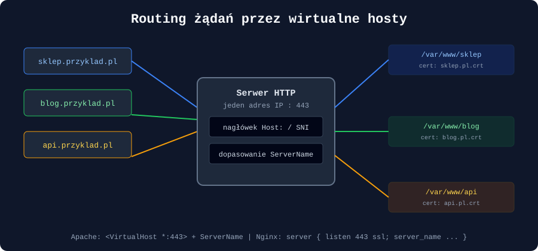
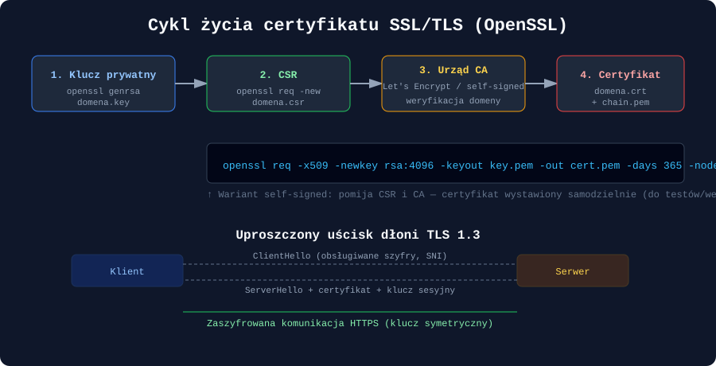
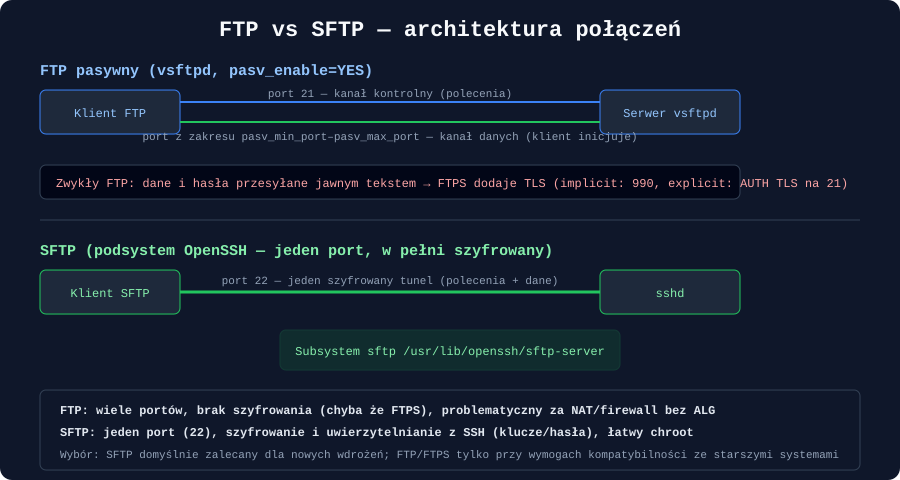

## Wprowadzenie

Uruchomienie serwera WWW to znacznie więcej niż instalacja pojedynczego pakietu. W praktyce administracyjnej trzeba zaprojektować obsługę wielu domen na jednym serwerze (**wirtualne hosty**), zabezpieczyć transmisję szyfrowaniem (**SSL/TLS**), a często również udostępnić kanał do przesyłania plików — historycznie przez **FTP**, dziś niemal zawsze w bezpieczniejszej formie **SFTP**. Ten artykuł prowadzi przez wszystkie te elementy na przykładzie dwóch najpopularniejszych serwerów HTTP — **Apache** i **Nginx** — oraz narzędzia **OpenSSL** i usługi **vsftpd**.

---

## 1. Apache vs Nginx — różnice architektoniczne

| Cecha | Apache (httpd) | Nginx |
|---|---|---|
| Model obsługi połączeń | domyślnie procesowy/wątkowy (MPM: `prefork`, `worker`, `event`) | zdarzeniowy, asynchroniczny (jeden proces obsługuje tysiące połączeń) |
| Konfiguracja | rozproszona, `.htaccess` per katalog | scentralizowana, brak odpowiednika `.htaccess` (świadomie, dla wydajności) |
| Typowe zastosowanie | aplikacje wymagające modułów `.htaccess`, dynamiczna konfiguracja per katalog | serwowanie statyczne, reverse proxy, load balancing, wysoka współbieżność |
| Moduły | `mod_php`, `mod_ssl`, `mod_rewrite` ładowane dynamicznie | mniejszy rdzeń, funkcje kompilowane statycznie lub jako moduły dynamiczne |

Wybór często nie jest rozłączny — powszechnym wzorcem jest **Nginx jako reverse proxy** przed Apache lub aplikacją w kontenerze, łączący zalety obu.

---

## 2. Instalacja i podstawowa konfiguracja

### 2.1 Apache

```bash
# Debian/Ubuntu
apt update && apt install apache2

# RHEL/Fedora/Rocky
dnf install httpd

systemctl enable --now apache2      # Debian/Ubuntu
systemctl enable --now httpd        # RHEL/Fedora
```

Kluczowe pliki i katalogi:

```bash
/etc/apache2/apache2.conf        # główny plik konfiguracyjny (Debian)
/etc/apache2/sites-available/    # definicje VirtualHost (nieaktywne)
/etc/apache2/sites-enabled/      # aktywne — dowiązania symboliczne
/etc/apache2/mods-enabled/       # aktywne moduły
/var/www/html/                   # domyślny katalog dokumentów
```

### 2.2 Nginx

```bash
apt install nginx        # Debian/Ubuntu
dnf install nginx        # RHEL/Fedora

systemctl enable --now nginx
```

Kluczowe pliki i katalogi:

```bash
/etc/nginx/nginx.conf             # główny plik konfiguracyjny
/etc/nginx/sites-available/       # definicje Server Block (Debian — konwencja)
/etc/nginx/sites-enabled/         # aktywne — dowiązania symboliczne
/etc/nginx/conf.d/                # alternatywna lokalizacja (RHEL — bezpośrednio ładowane)
/usr/share/nginx/html/            # domyślny katalog dokumentów
```

### 2.3 Weryfikacja składni przed przeładowaniem

```bash
apache2ctl configtest      # lub: httpd -t
nginx -t

systemctl reload apache2
systemctl reload nginx
```

Weryfikacja składni **przed** przeładowaniem to nawyk, który oszczędza niejeden przestój produkcyjny — błędna dyrektywa nie powinna nigdy trafić na żywą usługę bez testu.

---

## 3. Wirtualne hosty (Apache) i Server Blocks (Nginx)

Mechanizm wirtualnych hostów pozwala jednemu serwerowi fizycznemu (jednemu adresowi IP) obsługiwać wiele niezależnych domen, każdą z własnym katalogiem dokumentów, logami i — jak zobaczymy w sekcji o TLS — własnym certyfikatem.



### 3.1 Apache — `VirtualHost`

```apacheconf
# /etc/apache2/sites-available/sklep.przyklad.pl.conf
<VirtualHost *:80>
    ServerName sklep.przyklad.pl
    ServerAlias www.sklep.przyklad.pl
    DocumentRoot /var/www/sklep

    ErrorLog ${APACHE_LOG_DIR}/sklep_error.log
    CustomLog ${APACHE_LOG_DIR}/sklep_access.log combined

    <Directory /var/www/sklep>
        Options -Indexes +FollowSymLinks
        AllowOverride All
        Require all granted
    </Directory>
</VirtualHost>
```

```bash
a2ensite sklep.przyklad.pl.conf     # aktywacja (tworzy dowiązanie w sites-enabled)
a2dissite domyslna-strona.conf      # dezaktywacja
systemctl reload apache2
```

### 3.2 Nginx — `server { }` (Server Block)

```nginx
# /etc/nginx/sites-available/sklep.przyklad.pl
server {
    listen 80;
    server_name sklep.przyklad.pl www.sklep.przyklad.pl;
    root /var/www/sklep;
    index index.html index.php;

    access_log /var/log/nginx/sklep_access.log;
    error_log  /var/log/nginx/sklep_error.log;

    location / {
        try_files $uri $uri/ =404;
    }
}
```

```bash
ln -s /etc/nginx/sites-available/sklep.przyklad.pl /etc/nginx/sites-enabled/
nginx -t && systemctl reload nginx
```

> **Dobra praktyka:** każdą domenę trzymaj w osobnym pliku konfiguracyjnym — ułatwia to audyt, wdrażanie automatyzacji (Ansible/Puppet) i szybkie wyłączenie pojedynczej witryny bez ryzyka dla pozostałych.

---

## 4. Certyfikaty SSL/TLS — OpenSSL i konfiguracja HTTPS

### 4.1 Cykl życia certyfikatu



Standardowa ścieżka do certyfikatu zaufanego przez przeglądarki wygląda następująco: generujemy klucz prywatny, na jego podstawie tworzymy **CSR (Certificate Signing Request)**, który przekazujemy do urzędu certyfikacji (**CA**) — komercyjnego lub darmowego, jak Let's Encrypt — a ten w zamian wystawia podpisany certyfikat.

### 4.2 Generowanie certyfikatu self-signed (środowiska testowe/wewnętrzne)

```bash
openssl req -x509 -newkey rsa:4096 \
  -keyout /etc/ssl/private/domena.key \
  -out /etc/ssl/certs/domena.crt \
  -days 365 -nodes \
  -subj "/C=PL/ST=Mazowieckie/L=Warszawa/O=MojaFirma/CN=domena.przyklad.pl"
```

Certyfikat self-signed **nie jest zaufany** przez przeglądarki — przeglądarka wyświetli ostrzeżenie, ponieważ nie istnieje łańcuch zaufania do znanego urzędu CA. Nadaje się do środowisk deweloperskich, wewnętrznych API czy testów.

### 4.3 Generowanie klucza i CSR do podpisania przez CA

```bash
# Klucz prywatny
openssl genrsa -out domena.key 4096

# CSR na podstawie klucza
openssl req -new -key domena.key -out domena.csr \
  -subj "/C=PL/O=MojaFirma/CN=domena.przyklad.pl"

# Weryfikacja zawartości CSR
openssl req -text -noout -in domena.csr
```

Plik `domena.csr` przekazuje się urzędowi certyfikacji. W praktyce produkcyjnej rolę tę automatyzuje **Certbot** (klient Let's Encrypt), który obsługuje cały cykl — generowanie, weryfikację domeny i odnawianie certyfikatu:

```bash
apt install certbot python3-certbot-apache     # wtyczka dla Apache
apt install certbot python3-certbot-nginx      # wtyczka dla Nginx

certbot --apache -d domena.przyklad.pl -d www.domena.przyklad.pl
certbot --nginx  -d domena.przyklad.pl -d www.domena.przyklad.pl

# Test automatycznego odnowienia (certyfikaty Let's Encrypt ważne 90 dni)
certbot renew --dry-run
```

### 4.4 Konfiguracja HTTPS w Apache

```apacheconf
<VirtualHost *:443>
    ServerName sklep.przyklad.pl
    DocumentRoot /var/www/sklep

    SSLEngine on
    SSLCertificateFile      /etc/ssl/certs/domena.crt
    SSLCertificateKeyFile   /etc/ssl/private/domena.key
    SSLCertificateChainFile /etc/ssl/certs/chain.pem

    # Wzmocnienie konfiguracji TLS
    SSLProtocol             all -SSLv3 -TLSv1 -TLSv1.1
    SSLCipherSuite          HIGH:!aNULL:!MD5
    Header always set Strict-Transport-Security "max-age=63072000; includeSubDomains"
</VirtualHost>

# Przekierowanie HTTP -> HTTPS
<VirtualHost *:80>
    ServerName sklep.przyklad.pl
    Redirect permanent / https://sklep.przyklad.pl/
</VirtualHost>
```

```bash
a2enmod ssl headers
systemctl reload apache2
```

### 4.5 Konfiguracja HTTPS w Nginx

```nginx
server {
    listen 443 ssl http2;
    server_name sklep.przyklad.pl;
    root /var/www/sklep;

    ssl_certificate      /etc/ssl/certs/domena.crt;
    ssl_certificate_key  /etc/ssl/private/domena.key;

    ssl_protocols        TLSv1.2 TLSv1.3;
    ssl_ciphers          HIGH:!aNULL:!MD5;
    ssl_prefer_server_ciphers on;

    add_header Strict-Transport-Security "max-age=63072000; includeSubDomains" always;
}

# Przekierowanie HTTP -> HTTPS
server {
    listen 80;
    server_name sklep.przyklad.pl;
    return 301 https://$host$request_uri;
}
```

> **HSTS (`Strict-Transport-Security`)** informuje przeglądarkę, by przez zadeklarowany czas nigdy nie próbowała łączyć się przez zwykłe HTTP — eliminuje to okno podatności na atak typu *SSL stripping* przy pierwszym przekierowaniu.

### 4.6 Weryfikacja poprawności wdrożenia

```bash
openssl s_client -connect domena.przyklad.pl:443 -servername domena.przyklad.pl

# Sprawdzenie daty ważności certyfikatu
openssl x509 -in domena.crt -noout -dates
```

---

## 5. Serwer FTP — `vsftpd`

### 5.1 Instalacja i podstawowa konfiguracja

```bash
apt install vsftpd        # Debian/Ubuntu
dnf install vsftpd        # RHEL/Fedora

systemctl enable --now vsftpd
```

Kluczowy plik konfiguracyjny: `/etc/vsftpd.conf`.

```ini
# /etc/vsftpd.conf — istotne dyrektywy
anonymous_enable=NO
local_enable=YES
write_enable=YES
chroot_local_user=YES
allow_writeable_chroot=YES

# Tryb pasywny (zalecany za NAT/firewallem)
pasv_enable=YES
pasv_min_port=40000
pasv_max_port=40100

# Szyfrowanie — FTPS
ssl_enable=YES
rsa_cert_file=/etc/ssl/certs/domena.crt
rsa_private_key_file=/etc/ssl/private/domena.key
force_local_data_ssl=YES
force_local_logins_ssl=YES
```

### 5.2 Tryb aktywny vs pasywny



- **Tryb aktywny** — serwer inicjuje połączenie zwrotne do klienta na kanał danych; problematyczny w obecności NAT/firewalli po stronie klienta.
- **Tryb pasywny** — to klient inicjuje oba połączenia (kontrolne i danych); wymaga otwarcia na serwerze zakresu portów zdefiniowanego w `pasv_min_port`/`pasv_max_port`.

```bash
# Firewall dla FTP pasywnego
firewall-cmd --permanent --add-port=21/tcp
firewall-cmd --permanent --add-port=40000-40100/tcp
firewall-cmd --reload
```

### 5.3 Ograniczenia i ryzyka FTP

Zwykły FTP przesyła **dane i poświadczenia logowania jawnym tekstem** — w sieciach niezaufanych to poważne ryzyko przechwycenia haseł. `ssl_enable=YES` włącza wariant **FTPS** (FTP over SSL/TLS), ale samo istnienie protokołu FTP — z jego wieloma portami i skomplikowaną obsługą NAT — sprawia, że coraz częściej zastępuje się go całkowicie przez SFTP.

---

## 6. SFTP przez OpenSSH

SFTP (SSH File Transfer Protocol) **nie jest** wariantem FTP — to zupełnie inny protokół, działający jako podsystem w ramach istniejącego połączenia SSH. Korzysta z tego samego portu (domyślnie **22**), tego samego mechanizmu uwierzytelniania (hasła, klucze publiczne) i pełnego szyfrowania end-to-end.

### 6.1 Konfiguracja podstawowa

SFTP jest zwykle dostępny „od razu” wraz z serwerem OpenSSH — wystarczy, że w `/etc/ssh/sshd_config` obecna jest dyrektywa:

```bash
Subsystem sftp /usr/lib/openssh/sftp-server
```

### 6.2 Ograniczenie użytkownika wyłącznie do SFTP (chroot)

Częstym wymaganiem jest udostępnienie użytkownikowi tylko transferu plików, bez pełnego dostępu do powłoki systemowej:

```bash
# /etc/ssh/sshd_config
Match Group sftpusers
    ChrootDirectory /srv/sftp/%u
    ForceCommand internal-sftp
    AllowTcpForwarding no
    X11Forwarding no
```

```bash
groupadd sftpusers
useradd -m -G sftpusers -s /usr/sbin/nologin klient1
passwd klient1

# Katalog chroot musi należeć do roota i NIE może mieć prawa zapisu dla grupy/innych
chown root:root /srv/sftp/klient1
chmod 755 /srv/sftp/klient1

# Podkatalog na dane — już z prawem zapisu dla użytkownika
mkdir /srv/sftp/klient1/pliki
chown klient1:sftpusers /srv/sftp/klient1/pliki
```

```bash
systemctl restart sshd
```

> **Częsty błąd konfiguracyjny:** `ChrootDirectory` wymaga, aby katalog i wszystkie katalogi nadrzędne w ścieżce należały do `root:root` i nie miały prawa zapisu dla grupy/innych — w przeciwnym razie `sshd` odmówi uruchomienia sesji z komunikatem o „bad ownership or modes”.

### 6.3 Klucze publiczne zamiast haseł

```bash
# Po stronie klienta
ssh-keygen -t ed25519 -C "klient1@laptop"
ssh-copy-id -i ~/.ssh/id_ed25519.pub klient1@serwer.przyklad.pl
```

Wyłączenie logowania hasłem w `sshd_config` (`PasswordAuthentication no`) po wdrożeniu kluczy istotnie redukuje powierzchnię ataku (brute-force na hasła przestaje być możliwe).

---

## 7. Porównanie FTP / FTPS / SFTP

| Cecha | FTP | FTPS | SFTP |
|---|---|---|---|
| Szyfrowanie | brak | TLS (jawny lub domyślny) | pełne, w ramach SSH |
| Liczba portów | 2+ (kontrola + dane) | 2+ | 1 (port 22) |
| Uwierzytelnianie | login/hasło jawnym tekstem | login/hasło przez TLS | hasło lub klucz publiczny |
| Przyjazność dla NAT/firewall | problematyczna (tryb aktywny) | problematyczna | bardzo dobra (jeden port) |
| Typowe zastosowanie dziś | rzadko, systemy legacy | rzadziej niż SFTP | standard dla nowych wdrożeń |

---

## 8. Bezpieczeństwo i utwardzanie

- **HTTPS wszędzie** — przekierowuj cały ruch HTTP na HTTPS i stosuj HSTS.
- **Automatyczne odnawianie certyfikatów** — `certbot renew` w cronie/timerze systemd, aby uniknąć wygaśnięcia certyfikatu.
- **Wyłącz stare protokoły TLS** (SSLv3, TLS 1.0/1.1) i słabe zestawy szyfrów.
- **Ogranicz nagłówki serwera** (`ServerTokens Prod` w Apache, `server_tokens off;` w Nginx) — nie ujawniaj wersji oprogramowania atakującym.
- **`fail2ban`** dla `vsftpd` i `sshd` — automatyczna blokada adresów IP po serii nieudanych logowań.
- **Preferuj SFTP nad FTP/FTPS** dla nowych wdrożeń — mniejsza powierzchnia ataku, prostsza obsługa firewalla.
- **Regularny audyt certyfikatów** i konfiguracji TLS narzędziami zewnętrznymi (np. testami jakości konfiguracji SSL/TLS dostępnymi online).

---

## 9. Diagnostyka

| Polecenie | Zastosowanie |
|---|---|
| `apache2ctl -S` / `nginx -T` | wyświetlenie pełnej, przetworzonej konfiguracji wirtualnych hostów |
| `curl -I https://domena.pl` | szybka weryfikacja nagłówków odpowiedzi i kodu statusu |
| `openssl s_client -connect host:443` | inspekcja certyfikatu i przebiegu negocjacji TLS |
| `tail -f /var/log/nginx/error.log` | logi błędów w czasie rzeczywistym |
| `journalctl -u vsftpd -f` | logi usługi FTP w czasie rzeczywistym |
| `ss -tulpn \| grep :22` | weryfikacja, czy usługa nasłuchuje na oczekiwanym porcie |
| `sshd -T` | wyświetlenie efektywnej, przetworzonej konfiguracji `sshd_config` |

---

## Podsumowanie

Bezpieczne i poprawnie zaprojektowane wdrożenie serwera WWW opiera się na trzech filarach: elastycznej obsłudze wielu domen przez wirtualne hosty (Apache) lub bloki serwera (Nginx), pełnym szyfrowaniu transmisji poprzez certyfikaty SSL/TLS zarządzane narzędziem OpenSSL (najlepiej zautomatyzowane przez Certbot), oraz bezpiecznym kanałem transferu plików — gdzie SFTP oparty na SSH zdecydowanie wypiera klasyczny, niezaszyfrowany FTP. Każdy z tych elementów wymaga świadomego zarządzania cyklem życia (odnawianie certyfikatów, rotacja kluczy, przegląd konfiguracji) — jednorazowe wdrożenie bez planu utrzymania to najczęstsza przyczyna incydentów bezpieczeństwa w środowiskach produkcyjnych.

---

## Pytania kontrolne

1. Jakie są główne różnice architektoniczne między modelem obsługi połączeń w Apache a modelem zdarzeniowym Nginx?
2. Na czym polega mechanizm SNI (Server Name Indication) i dlaczego jest niezbędny przy obsłudze wielu certyfikatów HTTPS na jednym adresie IP?
3. Jakie kroki należy wykonać, aby wygenerować certyfikat self-signed za pomocą OpenSSL, i dlaczego przeglądarki mu nie ufają?
4. Czym różni się CSR (Certificate Signing Request) od gotowego certyfikatu i jaką rolę pełni w tym procesie urząd certyfikacji (CA)?
5. Do czego służy nagłówek `Strict-Transport-Security` (HSTS) i jaki atak pomaga ograniczyć?
6. Jaka jest różnica między trybem aktywnym a pasywnym FTP i dlaczego tryb pasywny jest preferowany w środowiskach z NAT/firewallem?
7. Dlaczego SFTP nie jest technicznie wariantem protokołu FTP, mimo podobnej nazwy i przeznaczenia?
8. Jakie warunki dotyczące właściciela i uprawnień musi spełniać katalog wskazany w dyrektywie `ChrootDirectory`, aby `sshd` poprawnie uruchomił sesję?
9. Jakie są praktyczne zalety stosowania uwierzytelniania kluczem publicznym zamiast hasła przy logowaniu SFTP/SSH?
10. Jakim poleceniem można sprawdzić z linii komend szczegóły certyfikatu i przebieg negocjacji TLS podczas łączenia się z serwerem HTTPS?