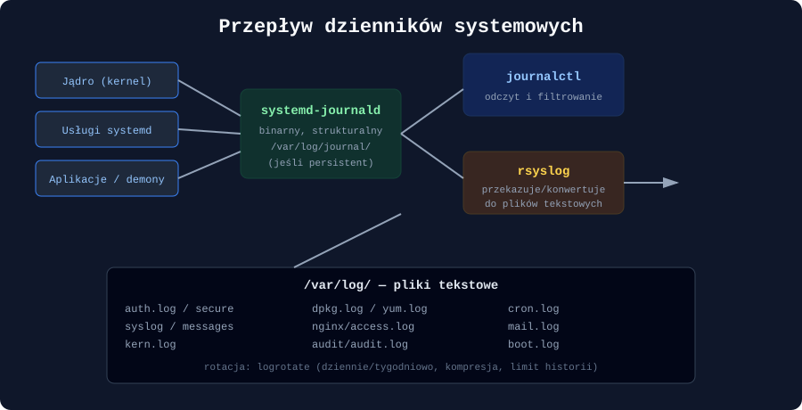
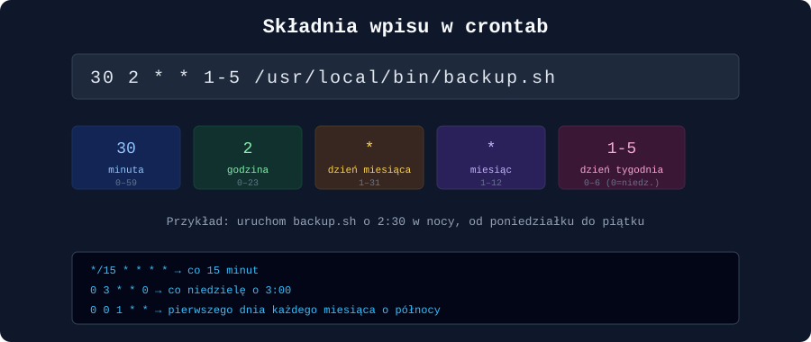
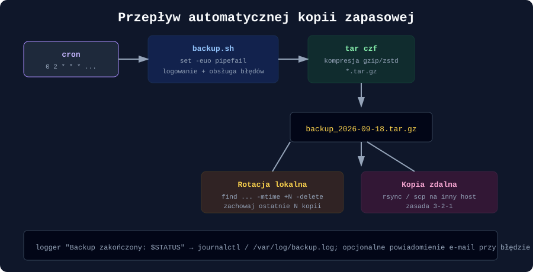

### Przegląd dzienników systemowych (`journalctl`, `/var/log`), zadania cykliczne (`cron`) oraz skrypty Bash do kopii zapasowych (`tar`)

---

## Wprowadzenie

Utrzymanie systemu w dobrej kondycji to nie tylko poprawna konfiguracja usług, ale przede wszystkim **widoczność** tego, co się w nim dzieje, oraz **automatyzacja** rutynowych zadań, których człowiek nie powinien wykonywać ręcznie każdego dnia. Ten artykuł łączy trzy filary codziennej pracy administratora: analizę dzienników systemowych (`journalctl` i klasyczne pliki w `/var/log`), harmonogramowanie zadań cyklicznych (`cron`), oraz projektowanie solidnych skryptów Bash do tworzenia i archiwizacji kopii zapasowych za pomocą `tar`.

---

## 1. Architektura logowania w systemach Linux

Współczesne dystrybucje oparte na systemd korzystają z dwóch uzupełniających się mechanizmów: **systemd-journald** (logowanie binarne, strukturalne) oraz klasycznego, tekstowego **rsyslog** zapisującego pliki w `/var/log`.



### 1.1 `journalctl` — przegląd i filtrowanie

```bash
journalctl                          # cały dziennik od najstarszych wpisów
journalctl -f                       # tryb "follow" — na żywo, jak tail -f
journalctl -e                       # przejście od razu na koniec dziennika
journalctl -r                       # od najnowszych do najstarszych

# Filtrowanie po usłudze
journalctl -u nginx.service
journalctl -u sshd -f

# Filtrowanie po czasie
journalctl --since "2026-09-18 08:00" --until "2026-09-18 12:00"
journalctl --since "1 hour ago"
journalctl --since yesterday

# Filtrowanie po priorytecie (0=emerg ... 7=debug)
journalctl -p err
journalctl -p warning..emerg

# Logi z bieżącego rozruchu systemu
journalctl -b
journalctl -b -1                    # poprzedni rozruch

# Logi konkretnego procesu (PID)
journalctl _PID=1234

# Format wyjścia JSON — przydatny do dalszego przetwarzania
journalctl -u nginx -o json-pretty
```

### 1.2 Trwałość dziennika i zarządzanie rozmiarem

Domyślnie na wielu dystrybucjach dziennik `journald` przechowywany jest wyłącznie w pamięci ulotnej (`/run/log/journal`) i ginie po restarcie. Aby zapewnić trwałość:

```bash
mkdir -p /var/log/journal
systemd-tmpfiles --create --prefix /var/log/journal
systemctl restart systemd-journald
```

Konfiguracja limitów w `/etc/systemd/journald.conf`:

```ini
[Journal]
Storage=persistent
SystemMaxUse=500M
MaxRetentionSec=90day
```

Ręczne czyszczenie dziennika:

```bash
journalctl --vacuum-size=200M       # ogranicz do maksymalnie 200 MB
journalctl --vacuum-time=30d        # zachowaj tylko ostatnie 30 dni
```

### 1.3 Klasyczne pliki w `/var/log`

| Plik | Zawartość |
|---|---|
| `/var/log/auth.log` (Debian) / `/var/log/secure` (RHEL) | próby logowania, `sudo`, uwierzytelnianie PAM |
| `/var/log/syslog` (Debian) / `/var/log/messages` (RHEL) | ogólne komunikaty systemowe |
| `/var/log/kern.log` | komunikaty jądra |
| `/var/log/dpkg.log` / `/var/log/yum.log` | historia instalacji/aktualizacji pakietów |
| `/var/log/audit/audit.log` | zdarzenia `auditd` (patrz sekcja 2) |
| `/var/log/cron` lub wpisy w `syslog` | historia uruchomień zadań cron |
| `/var/log/nginx/`, `/var/log/apache2/` | logi dostępu i błędów serwerów WWW |

Podstawowe narzędzia analizy tekstowej pozostają niezastąpione:

```bash
grep "Failed password" /var/log/auth.log | tail -20
awk '{print $1, $2, $3}' /var/log/syslog | uniq -c | sort -rn | head
zgrep "error" /var/log/nginx/error.log*.gz     # przeszukiwanie zarchiwizowanych, skompresowanych logów
```

### 1.4 Rotacja logów — `logrotate`

Pliki tekstowe w `/var/log` rosłyby w nieskończoność bez mechanizmu rotacji. Konfiguracja w `/etc/logrotate.d/`:

```bash
/var/log/nginx/*.log {
    daily
    rotate 14
    compress
    delaycompress
    missingok
    notifempty
    create 0640 www-data adm
    sharedscripts
    postrotate
        systemctl reload nginx > /dev/null 2>&1 || true
    endscript
}
```

---

## 2. Audyt bezpieczeństwa — `auditd`

Tam, gdzie `journalctl`/`/var/log` dają ogólny obraz zdarzeń, **auditd** pozwala na precyzyjne śledzenie na poziomie wywołań systemowych — np. kto i kiedy odczytał lub zmodyfikował konkretny plik.

```bash
apt install auditd audispd-plugins
systemctl enable --now auditd

# Reguła: monitoruj każdą zmianę pliku /etc/passwd
auditctl -w /etc/passwd -p wa -k zmiany_kont

# Wyszukiwanie zdarzeń wg klucza
ausearch -k zmiany_kont

# Czytelne podsumowanie
aureport --auth --summary
```

Reguły trwałe definiuje się w `/etc/audit/rules.d/audit.rules`, aby przetrwały restart usługi.

---

## 3. Zadania cykliczne — `cron`

### 3.1 Składnia crontab



Każdy wpis w crontab składa się z pięciu pól czasowych oraz polecenia do wykonania:

```bash
crontab -e          # edycja crontab bieżącego użytkownika
crontab -l           # wyświetlenie aktualnych zadań
crontab -r           # usunięcie wszystkich zadań (ostrożnie!)
```

Skróty specjalne:

```bash
@reboot     /skrypt.sh        # przy każdym starcie systemu
@daily      /skrypt.sh        # odpowiednik: 0 0 * * *
@weekly     /skrypt.sh        # odpowiednik: 0 0 * * 0
@monthly    /skrypt.sh        # odpowiednik: 0 0 1 * *
```

### 3.2 Cron systemowy vs użytkownika

| Lokalizacja | Zastosowanie |
|---|---|
| `crontab -e` (per użytkownik) | zadania osobiste, wykonywane z uprawnieniami danego konta |
| `/etc/cron.d/` | zadania systemowe instalowane przez pakiety, z jawnie podaną nazwą użytkownika w wierszu |
| `/etc/cron.daily/`, `/etc/cron.weekly/` | skrypty wykonywane cyklicznie przez `anacron`/`cron` — bez potrzeby definiowania harmonogramu ręcznie |
| `/etc/crontab` | globalny plik systemowy, format zawiera dodatkową kolumnę z nazwą użytkownika |

```bash
# /etc/cron.d/moja-aplikacja
30 2 * * * appuser /opt/aplikacja/bin/czyszczenie.sh
```

### 3.3 `anacron` — cron dla maszyn niepracujących bez przerwy

Standardowy `cron` pomija zadanie, jeśli system był wyłączony w zaplanowanym momencie. `anacron` (używany m.in. przez `/etc/cron.daily`) nadrabia pominięte zadania po najbliższym uruchomieniu systemu — istotne na laptopach i stacjach roboczych.

### 3.4 Środowisko wykonania i typowe pułapki

Zadania cron uruchamiane są w bardzo ograniczonym środowisku (bez pełnego `$PATH`, bez zmiennych powłoki interaktywnej), co jest najczęstszą przyczyną „działa ręcznie, nie działa w cronie”:

```bash
# Zawsze podawaj pełne ścieżki
0 3 * * * /usr/bin/tar czf /backup/dane.tar.gz /home/uzytkownik/dane

# Przekierowanie wyjścia do logu zamiast domyślnej poczty lokalnej
0 3 * * * /usr/local/bin/backup.sh >> /var/log/backup.log 2>&1

# Jawne ustawienie PATH na górze crontab
PATH=/usr/local/sbin:/usr/local/bin:/usr/sbin:/usr/bin:/sbin:/bin
```

### 3.5 Alternatywa: timery systemd

W nowszych wdrożeniach coraz częściej stosuje się **timery systemd** zamiast cron — dają lepsze logowanie (`journalctl -u`), obsługę zależności między usługami i precyzyjniejszą kontrolę:

```ini
# /etc/systemd/system/backup.timer
[Unit]
Description=Codzienny backup o 2:30

[Timer]
OnCalendar=*-*-* 02:30:00
Persistent=true

[Install]
WantedBy=timers.target
```

```bash
systemctl enable --now backup.timer
systemctl list-timers
```

---

## 4. Skrypty Bash do kopii zapasowych i archiwizacji (`tar`)

### 4.1 Podstawy `tar`

```bash
# Utworzenie archiwum skompresowanego gzip
tar czf archiwum.tar.gz /sciezka/do/katalogu

# Rozpakowanie
tar xzf archiwum.tar.gz -C /sciezka/docelowa

# Podgląd zawartości bez rozpakowywania
tar tzf archiwum.tar.gz

# Nowoczesna, szybsza kompresja zstd (jeśli dostępna)
tar --zstd -cf archiwum.tar.zst /sciezka/do/katalogu

# Wykluczanie katalogów/plików
tar czf archiwum.tar.gz --exclude='*.tmp' --exclude='./cache' /var/www
```

Objaśnienie najważniejszych flag: `c` (create), `x` (extract), `t` (list), `z` (gzip), `j` (bzip2), `f` (nazwa pliku archiwum — zawsze na końcu listy flag), `v` (verbose).

### 4.2 Kopie pełne vs przyrostowe

```bash
# Pełna kopia z listą referencyjną dla przyszłych przyrostów
tar --create --file=/backup/pelna_2026-09-01.tar.gz --gzip \
    --listed-incremental=/backup/snapshot.snar /home/uzytkownik

# Kopia przyrostowa — zawiera tylko zmiany od ostatniej kopii
tar --create --file=/backup/przyrost_2026-09-08.tar.gz --gzip \
    --listed-incremental=/backup/snapshot.snar /home/uzytkownik
```

### 4.3 Kompletny skrypt Bash do automatycznego backupu



```bash
#!/usr/bin/env bash
#
# backup.sh — tworzy skompresowaną kopię zapasową wskazanych katalogów,
# usuwa kopie starsze niż N dni i loguje wynik operacji.

set -euo pipefail    # przerwij przy błędzie, nieustawionej zmiennej lub błędzie w potoku
IFS=$'\n\t'

# --- Konfiguracja ---
readonly ZRODLA=(/etc /home /var/www)
readonly KATALOG_DOCELOWY="/backup"
readonly DNI_PRZECHOWYWANIA=14
readonly DATA=$(date +%Y-%m-%d_%H%M%S)
readonly NAZWA_ARCHIWUM="backup_${DATA}.tar.gz"
readonly SCIEZKA_ARCHIWUM="${KATALOG_DOCELOWY}/${NAZWA_ARCHIWUM}"
readonly LOG="/var/log/backup.log"

log() {
    echo "$(date '+%Y-%m-%d %H:%M:%S') $*" | tee -a "${LOG}"
}

sprzataj_przy_bledzie() {
    log "BŁĄD: backup przerwany, usuwam niekompletne archiwum."
    rm -f "${SCIEZKA_ARCHIWUM}"
}
trap sprzataj_przy_bledzie ERR

log "Rozpoczynam backup: ${ZRODLA[*]}"
mkdir -p "${KATALOG_DOCELOWY}"

tar czf "${SCIEZKA_ARCHIWUM}" "${ZRODLA[@]}" 2>>"${LOG}"

# Weryfikacja integralności archiwum
if ! tar tzf "${SCIEZKA_ARCHIWUM}" > /dev/null 2>&1; then
    log "BŁĄD: archiwum ${NAZWA_ARCHIWUM} jest uszkodzone!"
    exit 1
fi

ROZMIAR=$(du -h "${SCIEZKA_ARCHIWUM}" | cut -f1)
log "Backup zakończony sukcesem: ${NAZWA_ARCHIWUM} (${ROZMIAR})"

# Rotacja — usunięcie kopii starszych niż DNI_PRZECHOWYWANIA
find "${KATALOG_DOCELOWY}" -name "backup_*.tar.gz" -mtime "+${DNI_PRZECHOWYWANIA}" -print -delete | tee -a "${LOG}"

# Opcjonalna synchronizacja ze zdalnym serwerem (zasada 3-2-1: 3 kopie, 2 nośniki, 1 offsite)
if command -v rsync &> /dev/null; then
    rsync -az "${SCIEZKA_ARCHIWUM}" backupuser@serwer-zapasowy:/archiwa/ \
        && log "Kopia zsynchronizowana zdalnie." \
        || log "OSTRZEŻENIE: synchronizacja zdalna nie powiodła się."
fi

log "Zadanie backupu zakończone."
```

Wdrożenie w cronie:

```bash
0 2 * * * /usr/local/bin/backup.sh >> /var/log/backup_cron.log 2>&1
```

### 4.4 Dobre praktyki w skryptach Bash do backupu

- **`set -euo pipefail`** na początku każdego skryptu produkcyjnego — bez tego błąd w jednej linii może zostać po cichu zignorowany.
- **`trap` na sygnały `ERR`/`EXIT`** — gwarantuje sprzątanie tymczasowych plików nawet przy nieoczekiwanym przerwaniu.
- **Weryfikacja integralności archiwum** (`tar tzf`) — kopia zapasowa, której nie da się odtworzyć, jest bezwartościowa; warto to sprawdzać od razu po utworzeniu.
- **Jawne logowanie z znacznikiem czasu** do dedykowanego pliku, niezależnie od logów cron.
- **Rotacja starych kopii** (`find ... -mtime +N -delete`) — bez niej dysk z backupami prędzej czy później się zapełni.
- **Testowe odtwarzanie kopii** — backup, którego nigdy nie przetestowano przez faktyczne przywrócenie danych, nie jest w pełni zaufanym backupem.
- **Szyfrowanie wrażliwych archiwów** przed wysłaniem poza serwer:

```bash
gpg --symmetric --cipher-algo AES256 -o archiwum.tar.gz.gpg archiwum.tar.gz
# Odszyfrowanie:
gpg --decrypt archiwum.tar.gz.gpg > archiwum.tar.gz
```

---

## 5. Monitorowanie wykonania zadań cyklicznych

```bash
# Historia uruchomień cron w journalctl
journalctl -u cron -f          # Debian/Ubuntu (usługa "cron")
journalctl -u crond -f         # RHEL/Fedora (usługa "crond")

# Sprawdzenie, czy zadanie faktycznie się wykonało
grep CRON /var/log/syslog | tail -20

# Status i historia timerów systemd
systemctl status backup.timer
journalctl -u backup.service --since today
```

Dobrą praktyką jest, aby skrypt backupu kończył się jawnym kodem wyjścia i — w razie błędu — wysyłał powiadomienie (e-mail przez `mail`/`sendmail`, webhook do systemu monitoringu typu Zabbix/Prometheus Alertmanager), zamiast polegać wyłącznie na tym, że ktoś ręcznie przejrzy logi.

---

## Podsumowanie

Widoczność (logi) i automatyzacja (cron, skrypty backupowe) to dwie strony tej samej monety — dobrze skonfigurowany monitoring bez automatyzacji oznacza, że administrator musi ręcznie reagować na każdy sygnał, a automatyzacja bez monitoringu oznacza, że nikt nie dowie się, gdy zaplanowane zadanie zacznie zawodzić po cichu. `journalctl` i `/var/log` dają wgląd w bieżący i historyczny stan systemu, `cron` (lub jego nowocześniejszy odpowiednik — timery systemd) pozwala zautomatyzować rutynowe operacje, a solidnie napisany skrypt Bash oparty na `tar`, z obsługą błędów, weryfikacją integralności i rotacją, zamienia kopię zapasową z ryzykownego zadania „pamiętać, żeby zrobić” w niezawodny, samodzielnie działający proces.

---

## Pytania kontrolne

1. Jaka jest zasadnicza różnica między dziennikiem `systemd-journald` a klasycznymi plikami tekstowymi w `/var/log`?
2. Jakiej zmiany w `/etc/systemd/journald.conf` oraz jakich poleceń trzeba użyć, aby dziennik `journald` przetrwał restart systemu?
3. Jak przefiltrować logi tylko dla usługi `nginx` z ostatniej godziny za pomocą `journalctl`?
4. Do czego służy `auditd` i czym różni się zakres jego monitorowania od standardowych logów systemowych?
5. Rozpisz znaczenie każdego z pięciu pól czasowych we wpisie crontab `30 2 * * 1-5 /skrypt.sh`.
6. Dlaczego zadania uruchamiane przez cron często „nie działają”, mimo że ten sam skrypt uruchomiony ręcznie w terminalu działa poprawnie?
7. Czym różni się `cron` od `anacron` i w jakim scenariuszu (np. typie urządzenia) `anacron` ma istotną przewagę?
8. Jakie znaczenie ma opcja `set -euo pipefail` na początku skryptu Bash i jakie klasy błędów pomaga wychwycić?
9. Na czym polega różnica między pełną a przyrostową kopią zapasową tworzoną poleceniem `tar` z opcją `--listed-incremental`?
10. Jakie elementy powinien zawierać dobrze zaprojektowany skrypt backupu, aby kopia zapasowa była rzeczywiście przydatna w sytuacji awaryjnej, a nie tylko formalnie „wykonana”?