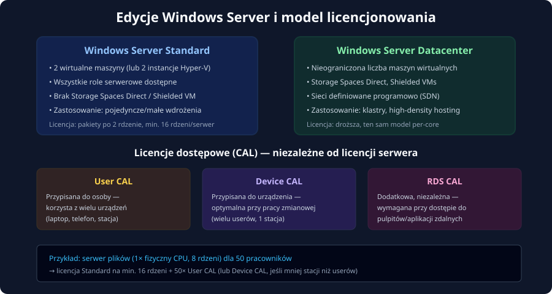
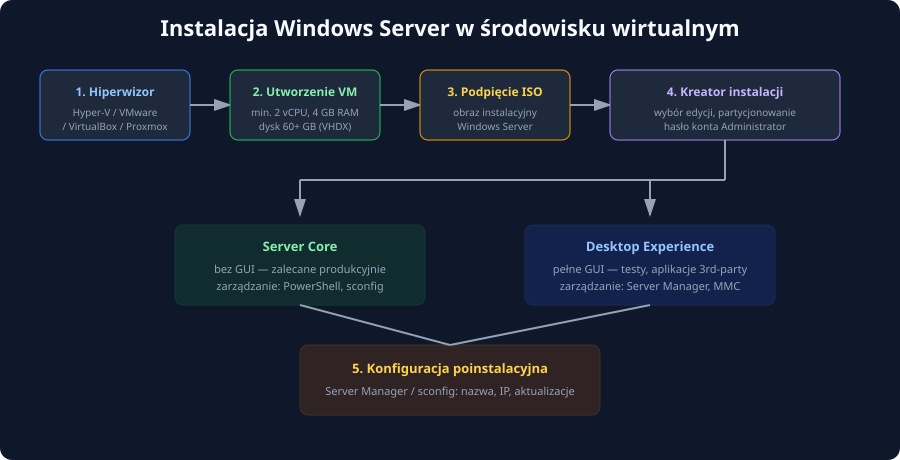
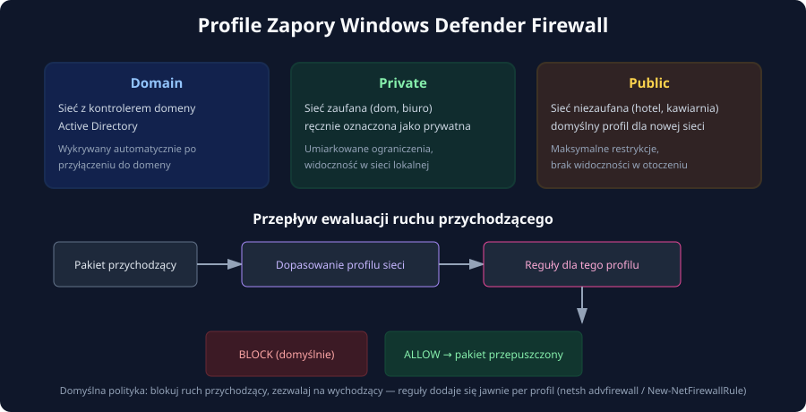

### Edycje i licencjonowanie (Core, Standard, CAL), instalacja w środowisku wirtualnym, Server Manager, konfiguracja sieci i zapory Windows Defender Firewall

---

## Wprowadzenie

Windows Server pozostaje jednym z filarów infrastruktury korporacyjnej — od kontrolerów domeny Active Directory, przez serwery plików i aplikacji, po platformy wirtualizacyjne oparte na Hyper-V. Zanim jednak administrator zdąży skonfigurować pierwszą rolę serwerową, musi podjąć świadome decyzje dotyczące **edycji i modelu licencjonowania**, przeprowadzić poprawną **instalację w środowisku wirtualnym**, a następnie wykonać podstawową **konfigurację poinstalacyjną**: nazwę serwera, adresację sieciową oraz reguły zapory. Ten artykuł prowadzi krok po kroku przez cały ten proces.

---

## 1. Edycje Windows Server

### 1.1 Standard vs Datacenter

Współczesny Windows Server (2019/2022/2025) występuje przede wszystkim w dwóch edycjach komercyjnych, różniących się nie funkcjonalnością podstawową, lecz limitami wirtualizacji i zaawansowanymi funkcjami dla środowisk hiperskalowych.



| Cecha | Standard | Datacenter |
|---|---|---|
| Liczba maszyn wirtualnych w cenie licencji | 2 | nieograniczona |
| Storage Spaces Direct, Storage Replica | brak | tak |
| Shielded Virtual Machines | brak | tak |
| Sieci definiowane programowo (SDN) | brak | tak |
| Typowe zastosowanie | pojedyncze serwery, małe wdrożenia | klastry, hosting, duża gęstość VM |

Dodatkowo dostępna jest edycja **Windows Server Essentials** (dla bardzo małych organizacji, z limitem 25 użytkowników) oraz warianty specjalizowane jak **Windows Server IoT**.

### 1.2 Server Core vs Desktop Experience

Niezależnie od wybranej edycji licencyjnej, podczas instalacji wybiera się wariant interfejsu:

- **Server Core** — brak powłoki graficznej (`explorer.exe`), zarządzanie przez PowerShell, `sconfig` lub zdalne narzędzia (Server Manager/RSAT z innej maszyny, Windows Admin Center). Mniejsze zużycie zasobów, mniejsza powierzchnia ataku, mniej wymaganych restartów przy aktualizacjach.
- **Server with Desktop Experience** — pełne środowisko graficzne, wygodniejsze dla początkujących administratorów i aplikacji firm trzecich wymagających instalatorów okienkowych.

> **Rekomendacja produkcyjna:** dla ról typu kontroler domeny, serwer DNS/DHCP, serwer plików — **Server Core** powinien być domyślnym wyborem. Desktop Experience rezerwuje się dla środowisk testowych lub aplikacji, które faktycznie tego wymagają.

---

## 2. Licencjonowanie

### 2.1 Model licencjonowania per-core

Licencje edycji Standard i Datacenter sprzedawane są w oparciu o **fizyczne rdzenie procesora**, z dwiema regułami minimalnymi:

1. Minimum **8 rdzeni** licencjonowanych na każdy fizyczny procesor.
2. Minimum **16 rdzeni** licencjonowanych na całą maszynę fizyczną.

Licencje sprzedawane są w pakietach po 2 rdzenie — praktyczny przykład: serwer z jednym procesorem 8-rdzeniowym i tak wymaga zakupu licencji na 16 rdzeni (reguła minimum serwerowego wygrywa).

### 2.2 Licencje dostępowe CAL

Sama licencja Windows Server uprawnia wyłącznie do **uruchomienia** oprogramowania. Każdy użytkownik lub urządzenie łączące się z jego usługami (udostępnianie plików, drukowanie, uwierzytelnianie domenowe) wymaga dodatkowo licencji dostępowej **CAL (Client Access License)**:

- **User CAL** — przypisana do konkretnej osoby; opłacalna, gdy jeden pracownik korzysta z wielu urządzeń (laptop, telefon, stacja stacjonarna).
- **Device CAL** — przypisana do urządzenia; opłacalna przy pracy zmianowej, gdy wielu pracowników dzieli tę samą stację roboczą.
- **RDS CAL** — dodatkowa, niezależna licencja wymagana przy dostępie do pulpitów zdalnych i aplikacji terminalowych (Remote Desktop Services), niezależnie od podstawowych CAL.

> **Uwaga praktyczna:** błędy w doborze licencji CAL to jeden z najczęstszych powodów niezgodności wykrywanych podczas audytów licencyjnych Microsoft — warto prowadzić rejestr przypisanych licencji od pierwszego dnia wdrożenia.

---

## 3. Instalacja w środowisku wirtualnym



### 3.1 Wymagania i przygotowanie maszyny wirtualnej

Typowe minimalne parametry maszyny wirtualnej dla celów laboratoryjnych/testowych:

- **vCPU:** minimum 2 rdzenie wirtualne,
- **RAM:** minimum 4 GB (2 GB dla Server Core, więcej zalecane dla ról produkcyjnych),
- **Dysk:** minimum 60 GB, format VHDX (Hyper-V) lub QCOW2/VMDK w zależności od hiperwizora,
- **Sieć wirtualna:** przełącznik zewnętrzny (Bridged) dla dostępności w sieci LAN, lub wewnętrzny/NAT dla izolowanego laboratorium.

Przed rozpoczęciem instalacji warto zweryfikować, czy procesor fizyczny hosta ma włączone rozszerzenia wirtualizacji sprzętowej (Intel VT-x / AMD-V) w BIOS/UEFI — bez tego nowoczesne hiperwizory typu Hyper-V lub VMware ESXi nie uruchomią maszyn wirtualnych.

### 3.2 Przebieg kreatora instalacji

1. Podłączenie obrazu ISO Windows Server do napędu wirtualnego maszyny.
2. Wybór języka, formatu czasu i układu klawiatury.
3. Wybór edycji: **Server Core** lub **Server with Desktop Experience**, oraz Standard/Datacenter (w zależności od posiadanego klucza/licencji).
4. Akceptacja warunków licencyjnych.
5. Wybór typu instalacji: **Custom: Install Windows only (advanced)** — zalecany zawsze dla nowej instalacji serwera (opcja aktualizacji dotyczy migracji z poprzedniej wersji).
6. Partycjonowanie dysku wirtualnego — dla prostych wdrożeń wystarcza jedna partycja; w środowiskach bardziej złożonych stosuje się dedykowane woluminy dla danych aplikacji.
7. Ustawienie hasła konta wbudowanego **Administrator** przy pierwszym logowaniu — musi spełniać domyślne wymogi złożoności (min. 8 znaków, wielkie/małe litery, cyfra lub znak specjalny).

---

## 4. Server Manager i pierwsza konfiguracja

**Server Manager** to centralna konsola zarządzania uruchamiająca się automatycznie po zalogowaniu w wariancie Desktop Experience. Pozwala na:

- przegląd zainstalowanych **ról** (Roles) i **funkcji** (Features) oraz dodawanie nowych przez kreator *Add Roles and Features Wizard*,
- zarządzanie wieloma serwerami zdalnie z jednej konsoli (po dodaniu ich do puli zarządzanych serwerów),
- szybki dostęp do podstawowych właściwości lokalnego serwera: nazwa komputera, konfiguracja Windows Update, stan zapory, ustawienia zdalnego pulpitu.

### 4.1 Konfiguracja przez `sconfig` (Server Core)

Na serwerach bez GUI podstawowa konfiguracja poinstalacyjna odbywa się przez narzędzie tekstowe `sconfig`, uruchamiane automatycznie po pierwszym logowaniu:

```powershell
sconfig
```

Menu `sconfig` pozwala m.in. na: zmianę nazwy komputera, dołączenie do domeny lub grupy roboczej, konfigurację adresu IP, włączenie zdalnego zarządzania, konfigurację Windows Update i strefy czasowej — bez znajomości pojedynczej komendy PowerShell.

### 4.2 Zmiana nazwy komputera (PowerShell)

```powershell
Rename-Computer -NewName "SRV-DC01" -Restart
```

Nadanie jednoznacznej, zgodnej z konwencją nazewniczą nazwy serwera **przed** uruchomieniem jakichkolwiek ról sieciowych (zwłaszcza Active Directory) jest krytyczne — zmiana nazwy kontrolera domeny po instalacji roli AD DS jest znacznie bardziej skomplikowana.

---

## 5. Konfiguracja interfejsu sieciowego

### 5.1 Statyczny adres IP — Server Manager (GUI)

W wariancie Desktop Experience: *Server Manager → Local Server → kliknięcie w link obok „Ethernet"* → właściwości karty sieciowej → *Internet Protocol Version 4 (TCP/IPv4)* → *Use the following IP address*:

- Adres IP: `192.168.10.10`
- Maska podsieci: `255.255.255.0`
- Brama domyślna: `192.168.10.1`
- Preferowany serwer DNS: `192.168.10.1` (lub adres kontrolera domeny)
- Alternatywny serwer DNS: `1.1.1.1`

### 5.2 Statyczny adres IP — PowerShell (Server Core i automatyzacja)

```powershell
# Wyświetlenie dostępnych interfejsów sieciowych
Get-NetAdapter

# Ustawienie statycznego adresu IP i bramy domyślnej
New-NetIPAddress -InterfaceAlias "Ethernet" -IPAddress 192.168.10.10 `
    -PrefixLength 24 -DefaultGateway 192.168.10.1

# Konfiguracja serwerów DNS
Set-DnsClientServerAddress -InterfaceAlias "Ethernet" `
    -ServerAddresses ("192.168.10.1","1.1.1.1")

# Weryfikacja konfiguracji
Get-NetIPConfiguration
```

Jeśli interfejs miał wcześniej skonfigurowany adres statyczny i trzeba go zmienić, należy go najpierw usunąć:

```powershell
Remove-NetIPAddress -InterfaceAlias "Ethernet" -Confirm:$false
Remove-NetRoute -InterfaceAlias "Ethernet" -Confirm:$false
```

### 5.3 Konfiguracja strefy czasowej i synchronizacji NTP

Poprawna synchronizacja czasu jest **krytycznym warunkiem** działania protokołu Kerberos w domenach Active Directory — rozbieżność większa niż 5 minut między klientem a kontrolerem domeny powoduje odmowę uwierzytelnienia.

```powershell
# Ustawienie strefy czasowej
Set-TimeZone -Id "Central European Standard Time"

# Wymuszenie synchronizacji czasu z serwerem NTP
w32tm /resync
```

---

## 6. Zapora Windows Defender Firewall

### 6.1 Profile sieciowe

Windows Defender Firewall automatycznie stosuje inny zestaw reguł w zależności od rozpoznanego typu sieci, do której podłączony jest interfejs.



| Profil | Kontekst zastosowania | Poziom restrykcji |
|---|---|---|
| **Domain** | sieć z widocznym kontrolerem domeny AD | ustalany centralnie przez GPO, zwykle umiarkowany |
| **Private** | sieć zaufana (dom, biuro), ręcznie oznaczona | umiarkowany, widoczność w sieci lokalnej |
| **Public** | sieć niezaufana (hotspot, sieć publiczna) | maksymalnie restrykcyjny, domyślny dla nowych sieci |

Domyślna polityka wszystkich profili to: **blokuj ruch przychodzący, zezwalaj na wychodzący**, o ile jawna reguła nie stanowi inaczej.

### 6.2 Zarządzanie regułami przez GUI

*Windows Defender Firewall with Advanced Security* (dostępne w Server Manager → Tools, lub `wf.msc`) pozwala na tworzenie reguł przychodzących i wychodzących z granularną kontrolą portów, protokołów, zakresów adresów IP oraz powiązania z konkretnym programem lub usługą.

### 6.3 Zarządzanie regułami przez PowerShell

```powershell
# Wyświetlenie wszystkich aktywnych reguł przychodzących
Get-NetFirewallRule -Direction Inbound -Enabled True

# Zezwolenie na ruch RDP (port 3389) tylko w profilu domenowym
New-NetFirewallRule -DisplayName "Zezwól RDP - Domain" `
    -Direction Inbound -Protocol TCP -LocalPort 3389 `
    -Profile Domain -Action Allow

# Zezwolenie na ICMP (ping) w profilu prywatnym
New-NetFirewallRule -DisplayName "Zezwól ICMPv4-In" `
    -Protocol ICMPv4 -Profile Private -Action Allow

# Wyłączenie/włączenie profilu Public całkowicie (niezalecane produkcyjnie bez potrzeby)
Set-NetFirewallProfile -Profile Public -Enabled False

# Usunięcie reguły po nazwie
Remove-NetFirewallRule -DisplayName "Zezwól RDP - Domain"
```

### 6.4 Zarządzanie przez `netsh` (starsze, wciąż spotykane w skryptach)

```cmd
netsh advfirewall firewall add rule name="Zezwol HTTP" dir=in action=allow protocol=TCP localport=80
netsh advfirewall show allprofiles state
```

> **Dobra praktyka:** po włączeniu roli lub funkcji serwerowej (np. IIS, DNS Server) system Windows automatycznie tworzy odpowiednie reguły zapory powiązane z tą rolą — ręczne dodawanie reguł portowych powinno być wyjątkiem, nie regułą, gdy istnieje dedykowana reguła grupowa dla danej usługi (`Get-NetFirewallRule -DisplayGroup "..."`).

---

## 7. Aktualizacje i utwardzanie poinstalacyjne

```powershell
# Sprawdzenie i instalacja dostępnych aktualizacji (moduł PSWindowsUpdate)
Install-Module PSWindowsUpdate -Force
Get-WindowsUpdate
Install-WindowsUpdate -AcceptAll -AutoReboot
```

Dodatkowe elementy standardowej listy kontrolnej po instalacji:

- wyłączenie niepotrzebnych usług i funkcji domyślnych,
- konfiguracja Windows Update (harmonogram, opóźnienie wdrożeń w środowiskach produkcyjnych),
- włączenie zdalnego zarządzania (`Enable-PSRemoting -Force`) dla administracji z konsoli centralnej,
- dołączenie do domeny Active Directory (jeśli dotyczy):

```powershell
Add-Computer -DomainName "firma.local" -Credential (Get-Credential) -Restart
```

---

## 8. Diagnostyka sieciowa

| Polecenie | Zastosowanie |
|---|---|
| `ipconfig /all` | pełny podgląd konfiguracji IP, DNS, bramy |
| `Test-NetConnection -ComputerName 192.168.10.1 -Port 443` | test dostępności hosta i konkretnego portu |
| `Get-NetIPConfiguration` | nowoczesny odpowiednik `ipconfig` w PowerShell |
| `Get-NetAdapter` | status i parametry fizycznych/wirtualnych kart sieciowych |
| `Resolve-DnsName nazwa.domeny` | test rozwiązywania nazw DNS |
| `Get-NetFirewallProfile` | sprawdzenie stanu (włączony/wyłączony) każdego profilu zapory |
| `w32tm /query /status` | status synchronizacji czasu NTP |

---

## Podsumowanie

Poprawne wdrożenie Windows Server zaczyna się długo przed pierwszym logowaniem administratora — od świadomego wyboru edycji (Standard/Datacenter) i wariantu instalacji (Server Core/Desktop Experience), przez zaplanowanie modelu licencjonowania per-core i CAL, po staranne przygotowanie maszyny wirtualnej. Konfiguracja poinstalacyjna — nazwa serwera, statyczna adresacja IP, synchronizacja czasu i reguły zapory Windows Defender Firewall — stanowi fundament, na którym dopiero buduje się kolejne role serwerowe. Zarówno Server Manager, jak i PowerShell dają pełną kontrolę nad tym procesem, przy czym w środowiskach produkcyjnych i zautomatyzowanych PowerShell pozostaje narzędziem docelowym, zwłaszcza dla wariantu Server Core.

---

## Pytania kontrolne

1. Jaka jest zasadnicza różnica funkcjonalna między edycją Windows Server Standard a Datacenter, i który parametr decyduje o wyborze jednej z nich w środowisku z dużą liczbą maszyn wirtualnych?
2. Czym różni się wariant instalacji Server Core od Server with Desktop Experience, i dlaczego Server Core jest zalecany dla ról produkcyjnych?
3. Ile rdzeni procesora minimum trzeba licencjonować dla serwera z jednym fizycznym procesorem 6-rdzeniowym, zgodnie z zasadami licencjonowania per-core?
4. Czym różni się licencja User CAL od Device CAL, i w jakim scenariuszu pracy Device CAL będzie bardziej opłacalna?
5. Do czego dodatkowo, niezależnie od podstawowych licencji CAL, potrzebna jest licencja RDS CAL?
6. Jakie minimalne parametry sprzętowe (vCPU, RAM, dysk) należy zapewnić maszynie wirtualnej przed instalacją Windows Server w środowisku testowym?
7. Jakim poleceniem PowerShell można ustawić statyczny adres IP oraz bramę domyślną na interfejsie sieciowym, a jakim skonfigurować serwery DNS?
8. Dlaczego poprawna synchronizacja czasu (NTP) jest krytycznym warunkiem działania protokołu Kerberos w środowisku Active Directory?
9. Jakie są trzy profile sieciowe rozpoznawane przez Windows Defender Firewall, i jaka jest domyślna polityka każdego z nich wobec ruchu przychodzącego?
10. Jakim poleceniem PowerShell można utworzyć regułę zapory zezwalającą na ruch RDP (port 3389) wyłącznie w profilu domenowym, i dlaczego ograniczenie reguły do konkretnego profilu ma znaczenie bezpieczeństwa?