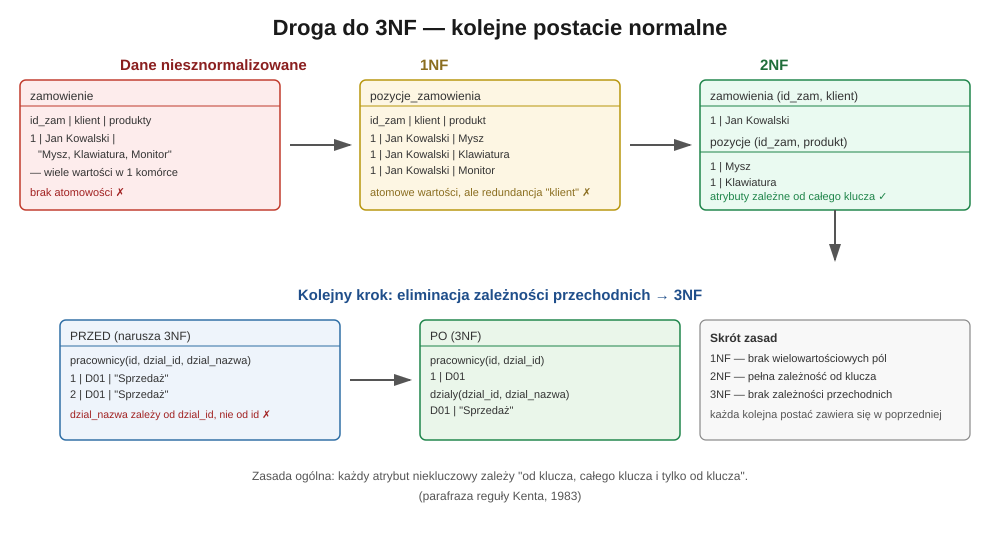
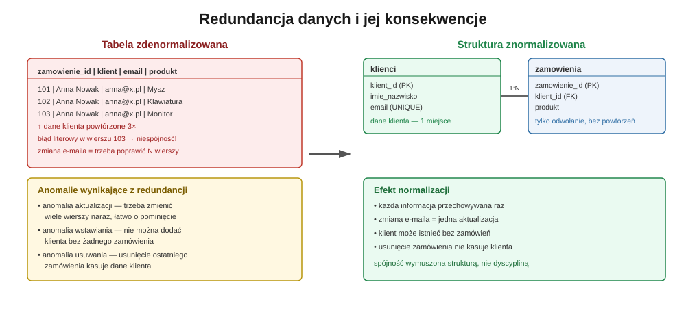

## Postacie normalne (1NF, 2NF, 3NF), atomowość danych, redundancja i wartości NULL

## 1. Po co w ogóle normalizować?

Normalizacja to zestaw formalnych reguł, które porządkują strukturę tabel relacyjnej bazy danych tak, aby:

- każda informacja była przechowywana **dokładnie w jednym miejscu**,
- struktura tabel odzwierciedlała **rzeczywiste zależności** między danymi, a nie przypadkowy sposób ich zapisania,
- baza była odporna na **anomalie** powstające przy wstawianiu, aktualizacji i usuwaniu rekordów.

Twórcą teorii normalizacji jest Edgar F. Codd, który w latach 70. XX wieku zdefiniował pierwsze trzy postacie normalne jako część algebry relacyjnej. Od tamtej pory 1NF, 2NF i 3NF stały się absolutnym standardem projektowania systemów transakcyjnych (OLTP) — baz obsługujących sklepy internetowe, systemy bankowe, aplikacje kadrowe czy CRM.

Warto od razu zaznaczyć: normalizacja nie jest sztuką dla sztuki. To narzędzie, które ma jeden cel — **zmniejszyć liczbę błędów, które popełni człowiek lub aplikacja, wpisując dane do bazy**.

---

## 2. Pierwsza postać normalna (1NF) — atomowość danych

### 2.1 Definicja

Tabela spełnia **pierwszą postać normalną**, jeśli:

1. każda kolumna zawiera **wartość atomową** (niepodzielną) — nie listę, nie zbiór, nie strukturę złożoną,
2. każdy wiersz jest **unikalny** (istnieje klucz identyfikujący rekord jednoznacznie),
3. kolejność wierszy i kolumn nie ma znaczenia semantycznego,
4. w kolumnie nie występują **powtarzające się grupy** atrybutów (np. `produkt_1`, `produkt_2`, `produkt_3`).

### 2.2 Przykład naruszenia atomowości

Wyobraźmy sobie tabelę zamówień, w której ktoś próbuje "na skróty" zapisać wiele produktów w jednej kolumnie:

| id_zamowienia | klient | produkty |
| --- | --- | --- |
| 1 | Jan Kowalski | Mysz, Klawiatura, Monitor |

Wygląda kompaktowo, ale w praktyce jest to **projektowa pułapka**:

- nie da się prostym zapytaniem SQL policzyć, ile sztuk danego produktu sprzedano,
- filtrowanie „pokaż zamówienia z monitorem” wymaga operacji tekstowych typu `LIKE '%Monitor%'`, co jest wolne i zawodne (co z produktem „Monitorek”?),
- dodanie lub usunięcie jednej pozycji wymaga modyfikacji całego napisu.

### 2.3 Rozwiązanie zgodne z 1NF

Rozbijamy wielowartościową kolumnę na osobne wiersze w tabeli podrzędnej:

| id_zamowienia | klient |
| --- | --- |
| 1 | Jan Kowalski |

| id_zamowienia | produkt |
| --- | --- |
| 1 | Mysz |
| 1 | Klawiatura |
| 1 | Monitor |

Ta sama zasada dotyczy atrybutów **złożonych**, np. adresu. Kolumna `adres = "ul. Kwiatowa 5, 00-001 Warszawa"` powinna zostać rozbita na `ulica`, `numer_domu`, `kod_pocztowy`, `miasto`. Dzięki temu można np. wyszukać wszystkich klientów z danego miasta bez parsowania tekstu.

> **Praktyczna wskazówka:** jeśli zastanawiasz się, czy dana kolumna jest atomowa, zadaj sobie pytanie: *„Czy kiedykolwiek będę chciał odpytać, sortować lub filtrować bazę po fragmencie tej wartości?”*. Jeśli tak — to sygnał, że wartość powinna zostać rozbita na osobne kolumny lub wiersze.



---

## 3. Druga postać normalna (2NF) — pełna zależność funkcyjna od klucza

### 3.1 Definicja

Tabela jest w **2NF**, jeśli:

1. spełnia 1NF, oraz
2. każdy atrybut niekluczowy zależy **funkcyjnie od całego klucza głównego**, a nie tylko od jego części.

Ta reguła ma znaczenie wyłącznie wtedy, gdy klucz główny jest **złożony** (składa się z więcej niż jednej kolumny). Jeśli klucz jest pojedynczy (np. surogat `id`), tabela automatycznie spełnia 2NF, o ile spełnia 1NF.

### 3.2 Przykład naruszenia 2NF

Załóżmy tabelę pozycji zamówień z kluczem złożonym `(id_zamowienia, id_produktu)`:

| id_zamowienia | id_produktu | ilosc | nazwa_produktu | cena_produktu |
| --- | --- | --- | --- | --- |
| 1 | 101 | 2 | Mysz | 49,99 |
| 1 | 102 | 1 | Klawiatura | 129,00 |
| 2 | 101 | 1 | Mysz | 49,99 |

Kolumna `ilosc` zależy od **całego** klucza (konkretnej pozycji w konkretnym zamówieniu) — to poprawne. Ale `nazwa_produktu` i `cena_produktu` zależą wyłącznie od `id_produktu`, czyli od **części** klucza. To złamanie 2NF, które prowadzi do redundancji: nazwa i cena „Mysz” powtarzają się za każdym razem, gdy produkt pojawia się w innym zamówieniu.

### 3.3 Rozwiązanie zgodne z 2NF

Wydzielamy dane produktu do osobnej tabeli:

**produkty** (`id_produktu` PK): `nazwa`, `cena`

**pozycje_zamowien** (`id_zamowienia`, `id_produktu` — klucz złożony): `ilosc`

Teraz cena i nazwa produktu istnieją w bazie **raz**, niezależnie od tego, w ilu zamówieniach dany produkt wystąpi.

---

## 4. Trzecia postać normalna (3NF) — eliminacja zależności przechodnich

### 4.1 Definicja

Tabela jest w **3NF**, jeśli:

1. spełnia 2NF, oraz
2. żaden atrybut niekluczowy nie zależy od innego atrybutu niekluczowego (nie ma tzw. **zależności przechodniej**).

Klasyczna, nieformalna parafraza reguły (przypisywana Williamowi Kentowi) brzmi:

> *Każdy atrybut niekluczowy zależy od klucza, całego klucza i tylko od klucza.*

### 4.2 Przykład naruszenia 3NF

| id_pracownika | imie_nazwisko | dzial_id | nazwa_dzialu |
| --- | --- | --- | --- |
| 1 | Anna Wiśniewska | D01 | Sprzedaż |
| 2 | Piotr Zieliński | D01 | Sprzedaż |
| 3 | Ewa Malinowska | D02 | Marketing |

`nazwa_dzialu` zależy od `dzial_id`, a nie bezpośrednio od klucza głównego `id_pracownika`. To zależność przechodnia: `id_pracownika → dzial_id → nazwa_dzialu`. Skutek: jeśli dział „Sprzedaż” zmieni nazwę na „Sprzedaż i Obsługa Klienta”, trzeba zaktualizować **wszystkie** wiersze pracowników tego działu — a pominięcie choćby jednego wprowadzi niespójność.

### 4.3 Rozwiązanie zgodne z 3NF

**pracownicy** (`id_pracownika` PK): `imie_nazwisko`, `dzial_id` (FK)

**dzialy** (`dzial_id` PK): `nazwa_dzialu`

Nazwa działu istnieje teraz w jednym miejscu. Zmiana nazwy to jedna operacja `UPDATE` na jednym wierszu.

### 4.4 Zależność między postaciami

Postacie normalne są **kumulatywne** — każda kolejna zawiera w sobie wymagania poprzedniej:

```
3NF ⊂ 2NF ⊂ 1NF
```

Nie da się osiągnąć 3NF bez wcześniejszego spełnienia 2NF i 1NF. W praktyce projektowej większość systemów transakcyjnych zatrzymuje się właśnie na 3NF (lub bardzo zbliżonej do niej postaci Boyce’a-Codda, BCNF) — to punkt, w którym relacja korzyści (spójność danych) do kosztu (liczba złączeń JOIN w zapytaniach) jest optymalna dla większości zastosowań biznesowych.

---

## 5. Redundancja danych — dlaczego jest wrogiem projektanta

Redundancja to sytuacja, w której ta sama informacja jest przechowywana w bazie więcej niż raz. Normalizacja to w praktyce **systematyczna eliminacja redundancji** poprzez rozdzielanie danych na tabele odpowiadające niezależnym „faktom” o świecie.

Konsekwencje redundancji to tzw. **anomalie**:

- **Anomalia aktualizacji (update anomaly)** — ta sama informacja powtórzona w wielu wierszach musi być zmieniana wielokrotnie. Pominięcie jednego wiersza prowadzi do niespójności (dwie „prawdy” w jednej bazie).
- **Anomalia wstawiania (insert anomaly)** — nie można zapisać pewnej informacji, dopóki nie pojawi się powiązany z nią rekord z innej kategorii. Przykład: w tabeli łączącej klientów i zamówienia nie da się dodać nowego klienta, który jeszcze nic nie zamówił, bo klucz zamówienia jest częścią tego samego wiersza.
- **Anomalia usuwania (delete anomaly)** — usunięcie jednego faktu przypadkowo kasuje inny, niepowiązany z nim fakt. Przykład: usunięcie ostatniego zamówienia klienta usuwa też jedyne miejsce, w którym zapisane były jego dane kontaktowe.



Redundancja bywa też źródłem cichych błędów — np. gdy ten sam adres e-mail klienta jest zapisany w trzech wierszach z drobną literówką w jednym z nich. Baza nie zgłosi błędu, bo formalnie to trzy różne wartości tekstowe — a mimo to dane są **niespójne semantycznie**.

---

## 6. Wartości NULL — kiedy są problemem, a kiedy koniecznością

### 6.1 Czym jest NULL

`NULL` w SQL oznacza **brak wartości** — nie jest to zero, pusty tekst ani żadna konkretna wartość domyślna. To stan „nieznane” lub „nie dotyczy”. Z tego powodu logika trójwartościowa SQL (`TRUE` / `FALSE` / `UNKNOWN`) potrafi zaskakiwać: `NULL = NULL` nie zwraca `TRUE`, tylko `UNKNOWN`.

### 6.2 Dlaczego nadmiar pustych pól szkodzi projektowi

Częste `NULL`e w tabeli to zwykle sygnał **błędu projektowego**, a nie cecha naturalna danych:

- **Zaburzają statystyki i agregacje** — funkcje takie jak `AVG()` czy `COUNT()` domyślnie pomijają `NULL`e, co może prowadzić do błędnych wniosków, jeśli programista o tym zapomni.
- **Komplikują warunki logiczne** — zapytania z `WHERE kolumna <> 'X'` niepostrzeżenie odrzucą też wiersze z `NULL`, ponieważ porównanie z `NULL` nigdy nie da `TRUE`.
- **Marnują przestrzeń koncepcyjną** — tabela z wieloma opcjonalnymi kolumnami (np. `dane_firmy_1`, `dane_firmy_2`, `dane_studenta_1`...) wypełnionymi `NULL`ami w zależności od typu rekordu to sygnał, że w rzeczywistości mamy do czynienia z **kilkoma różnymi encjami**, które sztucznie upchnięto w jednej tabeli.

### 6.3 Dobre praktyki ograniczania NULL

1. **Dziedziczenie / tabele podtypów** — jeśli tabela `uzytkownicy` ma zestaw kolumn tylko dla „firm” i zestaw tylko dla „osób prywatnych”, warto rozdzielić to na tabelę bazową `uzytkownicy` oraz dwie tabele rozszerzające: `firmy` i `osoby_prywatne`, połączone relacją 1:1.
2. **Wartości domyślne zamiast NULL, gdy mają sens biznesowy** — np. `liczba_zamowien DEFAULT 0` zamiast `NULL`, jeśli brak zamówień faktycznie oznacza zero, a nie „nie wiadomo”.
3. **NULL tylko tam, gdzie „nieznane” to realny stan** — np. `data_rozwiazania_umowy` może być `NULL`, dopóki umowa trwa — to semantycznie poprawne użycie.
4. **Ograniczenie `NOT NULL` jako domyślne założenie** — każdą kolumnę należy projektować z `NOT NULL`, a dopuszczenie `NULL` traktować jako świadomy wyjątek, a nie punkt wyjścia.

---

## 7. Projektowanie spójnych struktur — zasady praktyczne

Poniżej zestaw zasad, które w praktyce wynikają wprost z normalizacji, ale warto mieć je jako osobną checklistę projektową:

- **Jedna tabela = jeden temat.** Jeśli w nazwie tabeli musisz użyć spójnika „i” (`klienci_i_zamowienia`), to sygnał, że powinny to być dwie tabele.
- **Spójne nazewnictwo kolumn i typów.** Kolumna oznaczająca to samo pojęcie (np. identyfikator klienta) powinna nazywać się identycznie i mieć identyczny typ danych w każdej tabeli, w której występuje (`klient_id INT` wszędzie, nie raz `klient_id`, raz `id_klienta`, raz `klientID VARCHAR`).
- **Ograniczenia integralności jako pierwsza linia obrony.** `NOT NULL`, `UNIQUE`, `CHECK`, `FOREIGN KEY` powinny wymuszać poprawność danych na poziomie silnika bazy, a nie polegać wyłącznie na logice aplikacji — aplikacje się zmieniają i mają błędy, ograniczenia bazy są stałą gwarancją.
- **Unikanie kolumn typu „worek na wszystko”.** Kolumny typu `dane_dodatkowe TEXT` przechowujące JSON lub listę wartości oddzielonych przecinkami utrudniają walidację, indeksowanie i raportowanie. Dopuszczalne tylko wtedy, gdy struktura danych jest z natury nieprzewidywalna (np. metadane pluginów).
- **Świadoma denormalizacja — wyjątek, nie reguła.** W systemach analitycznych (hurtowniach danych, raportowaniu OLAP) czasem celowo wprowadza się redundancję dla wydajności odczytu (np. schemat gwiazdy). To jednak świadoma decyzja podejmowana **po** zaprojektowaniu poprawnego modelu znormalizowanego, a nie zamiast niego.

---

## 8. Podsumowanie

Normalizacja to nie biurokratyczny rytuał, tylko praktyczne narzędzie ograniczania ryzyka błędów w danych:

| Postać | Wymóg | Eliminuje |
| --- | --- | --- |
| 1NF | atomowe wartości, brak powtarzających się grup | dane wielowartościowe w jednej komórce |
| 2NF | pełna zależność od całego klucza | redundancję wynikającą z częściowej zależności |
| 3NF | brak zależności przechodnich | redundancję wynikającą z zależności atrybut–atrybut |

Dobrze znormalizowana baza jest łatwiejsza w utrzymaniu, mniej podatna na niespójności i czytelniejsza dla każdego kolejnego programisty, który będzie ją rozwijał. Koszt — więcej tabel i więcej operacji `JOIN` w zapytaniach — jest w zdecydowanej większości systemów transakcyjnych ceną wartą zapłacenia.

---

## 9. Pytania sprawdzające

1. Na czym polega zasada atomowości danych i dlaczego jest wymogiem pierwszej postaci normalnej (1NF)?
2. Podaj przykład kolumny naruszającej 1NF i pokaż, jak przekształcić ją do postaci zgodnej z tą regułą.
3. Kiedy problem drugiej postaci normalnej (2NF) w ogóle może wystąpić, a kiedy jest nieistotny z definicji?
4. Czym różni się zależność częściowa (naruszająca 2NF) od zależności przechodniej (naruszającej 3NF)?
5. Wyjaśnij na własnym przykładzie (innym niż w tekście) zależność przechodnią prowadzącą do naruszenia 3NF.
6. Jakie trzy rodzaje anomalii powoduje redundancja danych i na czym każda z nich polega?
7. Dlaczego duża liczba kolumn dopuszczających wartość `NULL` w jednej tabeli bywa sygnałem błędu projektowego?
8. Jak działa trójwartościowa logika SQL (`TRUE`/`FALSE`/`UNKNOWN`) i jakie pułapki stwarza przy porównaniach z `NULL`?
9. W jakich sytuacjach świadoma denormalizacja bywa uzasadniona, mimo że formalnie łamie zasady normalizacji?
10. Dlaczego mówi się, że postacie normalne są kumulatywne (3NF ⊂ 2NF ⊂ 1NF) i co to oznacza w praktyce projektowej?