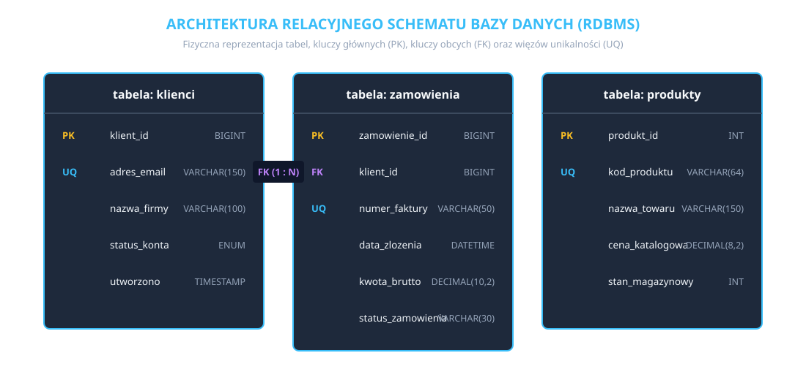

## 1. Wprowadzenie do transformacji konceptualno-logicznej

Projekcja modelu konceptualnego, czyli diagramu związków encji (ERD), do postaci relacyjnej bazy danych (RDBMS) stanowi fundamentalny etap inżynieryjny w procesie tworzenia oprogramowania. Na poziomie konceptualnym opisujemy świat rzeczywisty za pomocą pojęć niezależnych od konkretnego silnika bazodanowego, natomiast transformacja logiczna przekształca te założenia w zbiór znormalizowanych struktur tabelarycznych.

W systemach relacyjnych całość informacji organizowana jest w postaci dwuwymiarowych tabel składających się z wierszy (krotek) oraz kolumn (atrybutów). Aby zagwarantować spójność strukturalną, uniknąć redundancji danych oraz umożliwić bezbłędne odpytywanie bazy za pomocą języka SQL, projektant musi w sposób rygorystyczny wdrożyć mechanizmy unikatowych identyfikatorów oraz więzów integralności referencyjnej.

---

## 2. Szczegółowe zasady mapowania obiektów ERD na tabele relacyjne

Proces przechodzenia od modelu związków encji do fizycznego schematu bazy danych opiera się na stałych regułach przekształceń strukturalnych:

* **Mapowanie encji regularnych (silnych):** Każda niezależna encja z modelu ERD zostaje odwzorowana jako odrębna tabela w bazie danych. Nazwy tabel formułuje się zazwyczaj w liczbie mnogiej (np. klienci, zamówienia, produkty), odzwierciedlając fakt, że stanowią one kolekcje homogenicznych rekordów.
* **Mapowanie atrybutów prostych i złożonych:** Atrybuty proste (skalarne) stają się bezpośrednio kolumnami tabeli. Atrybuty złożone, takie jak adres składający się z ulicy, numeru domu, kodu pocztowego i miejscowości, podlegają bezwzględnej dekompozycji do niezależnych kolumn skalarnych, co jest wymogiem zachowania atomowości danych i pierwszej postaci normalnej (1NF).
* **Transformacja związków typu jeden do wielu (1:N):** Relacja o krotności 1:N realizowana jest poprzez fizyczną propagację klucza głównego z tabeli nadrzędnej (rodzica) do tabeli podrzędnej (potomka) w charakterze klucza obcego. Kolumna ta umożliwia powiązanie każdego wiersza potomnego z dokładnie jednym rekordem nadrzędnym.
* **Transformacja związków typu wiele do wielu (N:M):** Ponieważ relacyjne silniki bazodanowe nie obsługują bezpośrednich fizycznych połączeń wielokrotnych między dwoma tabelami, związek N:M wymaga utworzenia dodatkowej tabeli asocjacyjnej (łączącej). Tabela ta przechowuje klucze obce skierowane do obu powiązanych encji, rozbijając pierwotną relację N:M na dwie niezależne relacje typu jeden do wielu.

---

## 3. Architektura kluczy: Od teorii Codda do implementacji RDBMS

Integralność strukturalna i logiczna relacyjnej bazy danych opiera się na ścisłej hierarchii pojęciowej kluczy, wywodzącej się z algebry relacyjnej Edgara F. Codda:

* **Nadklucz (Superkey):** Dowolny podzbiór atrybutów w relacji, którego wartości jednoznacznie identyfikują każdą krotkę. Nadklucz może zawierać kolumny nadmiarowe, które nie są niezbędne do zachowania unikalności.
* **Klucz kandydujący (Candidate Key):** Minimalny nadklucz w sensie inkluzji – oznacza to, że usunięcie któregokolwiek atrybutu z tego zbioru natychmiast niszczy właściwość unikalności krotek.
* **Klucz główny (PRIMARY KEY):** Jeden wybrany przez projektanta klucz kandydujący, który staje się oficjalnym mechanizmem adresacji rekordów w tabeli. Zgodnie z regułą integralności encyjnej, żaden element klucza głównego nie może przyjmować wartości `NULL`. W silnikach takich jak InnoDB, klucz główny determinuje fizyczne ułożenie wierszy na dysku w postaci zbalansowanego drzewa indeksu klastrowego.
* **Klucze alternatywne (Alternate Keys):** Pozostałe klucze kandydujące, które nie zostały wybrane na klucz główny. W języku SQL są one zabezpieczane za pomocą ograniczenia `UNIQUE NOT NULL` (np. adres e-mail użytkownika, numer PESEL, kod VIN pojazdu).
* **Klucz obcy (FOREIGN KEY):** Atrybut lub zestaw atrybutów w tabeli podrzędnej, którego wartości muszą bezwzględnie odpowiadać wartościom klucza głównego w tabeli nadrzędnej lub przyjmować wartość `NULL`. Klucz obcy egzekwuje integralność referencyjną i uniemożliwia powstawanie rekordów-sierot.

---

## 4. Wybór klucza głównego: Klucz naturalny kontra surogat numeryczny

Jedną z najważniejszych decyzji architektonicznych podejmowanych podczas transformacji modelu E/R jest wybór fizycznego typu klucza głównego:

* **Klucze naturalne:** Oparte są na atrybutach występujących w rzeczywistości biznesowej (np. numer NIP firmy, adres e-mail, kod kraju ISO). Choć niosą ze sobą znaczenie semantyczne, ich wadą jest podatność na zmiany prawne, formatowe oraz błędy ludzkie przy wprowadzaniu danych, co drastycznie utrudnia modyfikację powiązanych kluczy obcych w całym systemie.
* **Klucze sztuczne (surogaty – Surrogate Keys):** Są to techniczne atrybuty niemające żadnego znaczenia w świecie rzeczywistym, najczęściej w postaci rosnących liczb całkowitych generowanych automatycznie przez mechanizm `AUTO_INCREMENT` (np. `BIGINT`). Surogaty są całkowicie odporne na zmiany w otoczeniu biznesowym, gwarantują stałość identyfikatorów oraz zapewniają najwyższą wydajność operacji wstawiania i indeksowania.

---

## 5. Schemat wizualny transformacji relacyjnej

Poniższy schemat ilustruje fizyczną strukturę znormalizowanych tabel powstałych w wyniku transformacji modelu konceptualnego zamówień i produktów.

**Opis diagramu:** Schemat prezentuje powiązane tabele `klienci`, `zamowienia` oraz `produkty`. Tabela `klienci` posiada klucz główny `klient_id` oraz kolumnę unikalną `adres_email (UQ)`. Tabela `zamowienia` zawiera klucz główny `zamowienie_id` oraz klucz obcy `klient_id`, który tworzy powiązanie typu 1:N z tabelą klientów. Tabela `produkty` stanowi niezależną encję asortymentową z kluczem głównym `produkt_id`.

---

## 6. Integralność referencyjna i akcje kaskadowe (Referential Actions)

Wprowadzenie więzów klucza obcego w języku SQL wymaga określenia sposobu zachowania bazy danych w sytuacji, gdy modyfikowany lub usuwany jest rekord nadrzędny (rodzic) powiązany z danymi potomnymi:

* **RESTRICT / NO ACTION:** Domyślna polityka bezpieczeństwa. System całkowicie odrzuca operację usunięcia lub zmiany klucza głównego w tabeli nadrzędnej, jeśli w tabeli podrzędnej istnieją powiązane z nim rekordy.
* **CASCADE:** Wprowadza pełną kaskadowość operacji. Usunięcie rekordu nadrzędnego powoduje automatyczne, natychmiastowe usunięcie wszystkich powiązanych rekordów potomnych, natomiast zmiana wartości klucza głównego aktualizuje klucze obce w całej hierarchii.
* **SET NULL:** Sprawia, że w przypadku usunięcia lub modyfikacji rekordu nadrzędnego, kolumny klucza obcego w tabeli potomnej są automatycznie czyszczone i przyjmują wartość `NULL` (wymaga to rezygnacji z ograniczenia `NOT NULL` na kolumnie klucza obcego).

---

## Pytania sprawdzające do lekcji

1. Czym różni się pod względem logicznym i fizycznym klucz główny (PRIMARY KEY) od ograniczenia unikalności (UNIQUE) w architekturze relacyjnej bazy danych?
2. Jakie ryzyka technologiczne i biznesowe niesie za sobą stosowanie kluczy naturalnych w roli kluczy głównych rozbudowanych systemów informatycznych?
3. W jaki sposób mechanizm klucza obcego (FOREIGN KEY) zabezpiecza bazę danych przed powstawaniem tzw. rekordów-sierot?
4. Dlaczego w transakcyjnych silnikach opartych na indeksach klastrowych (np. InnoDB) zaleca się stosowanie monotonicznie rosnących kluczy sztucznych (`AUTO_INCREMENT`) zamiast losowych ciągów?
5. Jakie są operacyjne konsekwencje zastosowania reguły kaskadowej `ON DELETE CASCADE` przy usuwaniu wiersza z tabeli nadrzędnej?

