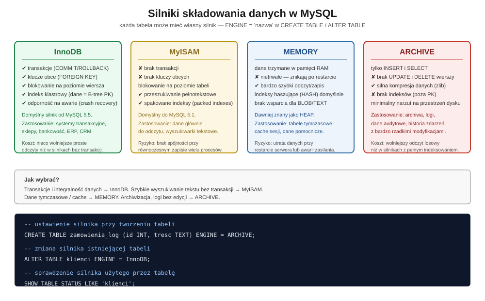
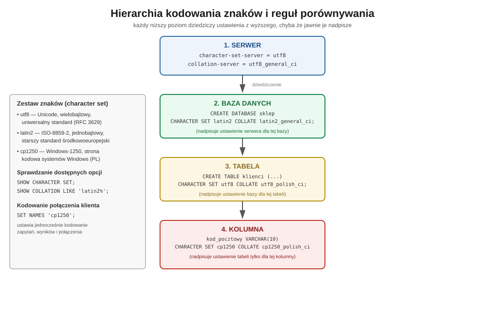

## Silniki bazodanowe, zestawy znaków narodowych i reguły porównywania w MySQL
---
## 1. Wprowadzenie

Poza logicznym modelem tabel (kluczami, normalizacją, typami danych) MySQL pozwala świadomie sterować dwoma warstwami, które decydują o wydajności, trwałości i poprawności zapisu danych na dysku:

1. **silnikiem składowania (storage engine)** — czyli mechanizmem, który fizycznie zapisuje, odczytuje i indeksuje wiersze tabeli,
2. **systemem kodowania znaków (character set) i regułami ich porównywania (collation)** — czyli sposobem, w jaki tekst jest zapisywany bajtowo i sortowany/porównywany.

Obie te decyzje podejmuje się **per tabela**, a w przypadku kodowania — nawet **per kolumna**. To jedna z cech, które odróżniają MySQL od wielu innych silników baz danych: różne tabele w tej samej bazie mogą mieć zupełnie inną charakterystykę fizyczną.

---

## 2. Silniki bazodanowe (storage engines)

### 2.1 Czym jest silnik składowania

Silnik składowania to komponent serwera odpowiedzialny za fizyczną implementację tabeli: format plików na dysku, sposób indeksowania, obsługę blokad przy współbieżnym dostępie oraz (opcjonalnie) obsługę transakcji. Silnik przypisuje się tabeli podczas jej tworzenia lub zmienia później:

```sql
-- ustawienie silnika przy tworzeniu tabeli
CREATE TABLE zamowienia
(
    id_zamowienia INT PRIMARY KEY,
    klient_id     INT,
    data_zlozenia DATE
) ENGINE = InnoDB;

-- zmiana silnika istniejącej tabeli
ALTER TABLE zamowienia ENGINE = MyISAM;

-- sprawdzenie, jakiego silnika używa konkretna tabela
SHOW TABLE STATUS LIKE 'zamowienia';
```

Domyślny silnik serwera (używany, gdy klauzula `ENGINE` zostanie pominięta) ustawia się parametrem konfiguracyjnym `default-storage-engine` w pliku `my.ini`/`my.cnf`.

### 2.2 InnoDB — silnik transakcyjny

**InnoDB** jest domyślnym silnikiem w nowoczesnych wersjach MySQL i podstawowym wyborem dla każdego systemu, w którym liczy się spójność danych:

- obsługuje **transakcje** (`START TRANSACTION`, `COMMIT`, `ROLLBACK`) zgodne z zasadą ACID,
- egzekwuje **klucze obce** (`FOREIGN KEY`), co pozwala wymusić integralność referencyjną na poziomie silnika, a nie tylko aplikacji,
- stosuje **blokowanie na poziomie wiersza** (row-level locking) zamiast całej tabeli, dzięki czemu wielu użytkowników może jednocześnie modyfikować różne wiersze tej samej tabeli bez wzajemnego blokowania się,
- fizycznie przechowuje dane w postaci **indeksu klastrowego** — wiersze tabeli są fizycznie ułożone na dysku według kolejności klucza głównego, co przyspiesza odczyt po kluczu głównym,
- posiada mechanizmy **odzyskiwania po awarii** (crash recovery) dzięki dziennikowi transakcji (redo log).

Naturalne zastosowania: sklepy internetowe, systemy bankowe i księgowe, aplikacje CRM/ERP — wszędzie tam, gdzie błąd w spójności danych (np. zamówienie bez klienta) jest niedopuszczalny.

### 2.3 MyISAM — szybkość kosztem transakcyjności

**MyISAM** był domyślnym silnikiem w starszych wersjach MySQL. Jego charakterystyczne cechy:

- **brak wsparcia dla transakcji** — każda instrukcja `INSERT`/`UPDATE`/`DELETE` jest wykonywana natychmiast i nieodwracalnie,
- **brak kluczy obcych** — integralność referencyjną trzeba wymuszać wyłącznie na poziomie aplikacji,
- blokowanie odbywa się na poziomie **całej tabeli**, co przy dużej liczbie równoczesnych zapisów może stać się wąskim gardłem,
- za to oferuje wbudowane **przeszukiwanie pełnotekstowe** (`FULLTEXT`) oraz **spakowane indeksy** (packed indexes), które zmniejszają rozmiar plików indeksowych.

MyISAM sprawdza się w scenariuszach z przewagą odczytów nad zapisami i bez wymogu transakcyjności — np. archiwalne zestawienia raportowe czy wyszukiwarki treści tekstowych.

### 2.4 MEMORY — tabele w pamięci operacyjnej

**MEMORY** (dawniej znany jako `HEAP`) przechowuje całą zawartość tabeli w pamięci RAM serwera:

- odczyt i zapis są ekstremalnie szybkie, bo pomijają operacje dyskowe,
- dane są **nietrwałe** — znikają całkowicie po restarcie serwera lub jego awarii,
- domyślnie wykorzystuje indeksy typu `HASH` (możliwe też `BTREE`),
- nie obsługuje kolumn typu `BLOB` ani `TEXT`.

Typowe zastosowania: tabele tymczasowe do przetwarzania pośrednich wyników zapytań, tablice przeglądowe (lookup tables) używane wielokrotnie w krótkim czasie, cache sesji.

### 2.5 ARCHIVE — kompresja i dane tylko do odczytu

**ARCHIVE** to silnik zaprojektowany do przechowywania dużych ilości rzadko zmienianych danych:

- pozwala jedynie na operacje `INSERT` i `SELECT` — **nie obsługuje `UPDATE` ani `DELETE`** pojedynczych wierszy,
- stosuje silną kompresję danych (algorytm zlib), co znacząco zmniejsza zajmowaną przestrzeń dyskową,
- nie tworzy indeksów poza kluczem głównym, co czyni odczyt losowy wolniejszym niż w InnoDB czy MyISAM.

Naturalne zastosowanie: logi zdarzeń, dane audytowe, historyczne zapisy transakcji, których nikt nie będzie modyfikował, a jedynie sporadycznie odczytywał.

### 2.6 Porównanie silników



| Silnik | Transakcje | Klucze obce | Poziom blokady | Typowe zastosowanie |
| --- | --- | --- | --- | --- |
| InnoDB | Tak | Tak | wiersz | systemy transakcyjne, e-commerce |
| MyISAM | Nie | Nie | tabela | odczyt-dominujące raporty, wyszukiwanie pełnotekstowe |
| MEMORY | Nie | Nie | tabela | dane tymczasowe, cache |
| ARCHIVE | Nie | Nie | — (tylko insert) | logi, archiwa, dane audytowe |

---

## 3. Systemy kodowania znaków

### 3.1 Character set a collation — dwa różne pojęcia

Prawidłowa obsługa tekstu w MySQL wymaga ustalenia dwóch niezależnych, choć powiązanych elementów:

- **zestaw znaków (character set)** — definiuje, jakie znaki są dostępne i jak są zakodowane bajtowo (np. ile bajtów zajmuje jeden znak),
- **reguły porównywania (collation)** — definiują, jak dwa teksty są ze sobą porównywane i sortowane (np. czy wielkość liter ma znaczenie, czy „ą” sortuje się zaraz po „a”).

Każdy zestaw znaków ma przypisaną domyślną regułę porównywania, dlatego w praktyce najczęściej wystarczy wskazać sam zestaw znaków — silnik dobierze rozsądne domyślne reguły porównywania automatycznie.

### 3.2 Najważniejsze zestawy znaków

| Zestaw | Opis | Liczba bajtów na znak |
| --- | --- | --- |
| `utf8` / `utf8mb4` | Unicode, standard zgodny z RFC 3629 | zmienna (1–4 bajty) |
| `latin2` | ISO-8859-2 — starszy standard środkowoeuropejski | 1 bajt |
| `cp1250` | Windows-1250 — strona kodowa systemów Windows dla języków środkowoeuropejskich | 1 bajt |
| `cp852` | strona kodowa 852, stosowana historycznie w DOS-ie | 1 bajt |

Dostępne w danej instalacji serwera zestawy znaków i reguły porównywania można sprawdzić poleceniami:

```sql
-- lista dostępnych zestawów znaków
SHOW CHARACTER SET;

-- lista wszystkich dostępnych reguł porównywania
SHOW COLLATION;

-- lista reguł porównywania zaczynających się od "latin2"
SHOW COLLATION LIKE 'latin2%';
```

### 3.3 Nazewnictwo reguł porównywania

Nazwa reguły porównywania zwykle składa się z nazwy zestawu znaków oraz przyrostka określającego zachowanie:

- `_general_ci` — porównywanie ogólne, bez rozróżniania wielkości liter (*case insensitive*),
- `_bin` — porównywanie binarne, bajt po bajcie, z rozróżnianiem wielkości liter — najściślejsza, ale najmniej „naturalna językowo” metoda,
- `_polish_ci` — reguły uwzględniające polską kolejność alfabetyczną (np. poprawne sortowanie znaków „ą”, „ć”, „ł”, „ń”, „ó”, „ś”, „ź”, „ż”).

Przykładowo dla zestawu `utf8` dostępne są m.in. `utf8_general_ci` oraz `utf8_polish_ci`; analogicznie dla `cp1250` — `cp1250_general_ci` i `cp1250_polish_ci`.

---

## 4. Hierarchia ustawień: serwer → baza → tabela → kolumna

Kodowanie znaków w MySQL można ustalić na czterech niezależnych poziomach, przy czym każdy niższy poziom **dziedziczy** ustawienie z wyższego, jeśli nie zostanie jawnie nadpisany.



### 4.1 Poziom serwera

Ustawiany w pliku konfiguracyjnym lub przy starcie procesu serwera:

```ini
# w pliku my.ini / my.cnf
character-set-server = utf8
collation-server = utf8_general_ci
```

lub przy uruchamianiu z wiersza poleceń:

```bash
mysqld --console --character-set-server=utf8
```

To ustawienie staje się domyślne dla wszystkich nowo tworzonych baz danych, które nie określą własnego zestawu znaków.

### 4.2 Poziom bazy danych

```sql
-- utworzenie bazy z własnym zestawem znaków
CREATE DATABASE sklep CHARACTER SET latin2;

-- utworzenie bazy z zestawem znaków i regułami porównywania
CREATE DATABASE sklep
    CHARACTER SET latin2
    COLLATE latin2_bin;

-- zmiana zestawu znaków dla istniejącej bazy
ALTER DATABASE sklep
    CHARACTER SET utf8
    COLLATE utf8_polish_ci;
```

Ustawienie to staje się domyślne dla wszystkich tabel tej bazy, które nie zdefiniują własnego zestawu znaków.

### 4.3 Poziom tabeli

```sql
-- tabela z własnym zestawem znaków
CREATE TABLE klienci
(
    id     INT PRIMARY KEY,
    nazwa  VARCHAR(50)
) CHARACTER SET utf8 COLLATE utf8_polish_ci;
```

### 4.4 Poziom kolumny

Konkretną kolumnę tekstową (`CHAR`, `VARCHAR`, `TEXT`, a także `ENUM` i `SET`) można wyróżnić spośród pozostałych kolumn tabeli, nadając jej inny zestaw znaków niż reszcie tabeli:

```sql
CREATE TABLE klienci
(
    id            INT PRIMARY KEY,
    nazwa         VARCHAR(50) CHARACTER SET utf8 COLLATE utf8_polish_ci,
    kod_pocztowy  VARCHAR(10) CHARACTER SET cp1250
) CHARACTER SET utf8;
```

W powyższym przykładzie cała tabela domyślnie korzysta z `utf8`, ale kolumna `kod_pocztowy` jawnie nadpisuje to ustawienie na `cp1250`. Jest to przydatne np. przy migracji danych ze starszego systemu, gdzie tylko wybrane pola pochodzą z odmiennego źródła kodowania.

### 4.5 Kodowanie połączenia klienckiego

Niezależnie od ustawień serwera, bazy i tabeli, każde **połączenie klienta** z serwerem operuje na własnych regułach kodowania — serwer musi wiedzieć, w jakim kodowaniu klient wysyła zapytania i w jakim ma otrzymać odpowiedź:

```sql
-- ustawienie kodowania dla bieżącego połączenia
SET NAMES 'cp1250';

-- z jawnym wskazaniem reguł porównywania
SET NAMES 'utf8' COLLATE 'utf8_polish_ci';
```

> **Uwaga praktyczna:** kodowanie znaków klienta (np. konsoli, z której łączymy się poleceniem `mysql`) powinno być zgodne z kodowaniem zadeklarowanym przez `SET NAMES`. Niezgodność prowadzi do widocznych „krzaczków” przy wyświetlaniu polskich znaków, a w skrajnych przypadkach do nieoczekiwanego zakończenia pracy klienta.

---

## 5. Praktyczne wskazówki projektowe

- **Ustalaj kodowanie świadomie, a nie przez przypadek.** Poleganie wyłącznie na ustawieniach domyślnych serwera bywa ryzykowne, gdy aplikacja trafi na inną instalację MySQL z innymi ustawieniami fabrycznymi.
- **Zachowuj spójność w obrębie jednej bazy.** Mieszanie różnych zestawów znaków między tabelami tej samej bazy utrudnia porównania międzytabelowe (np. `JOIN` po kolumnie tekstowej może wymagać jawnej konwersji `CONVERT(... USING ...)`, jeśli kodowania po obu stronach się różnią).
- **Dobieraj regułę porównywania do języka danych.** Reguła `_general_ci` sortuje znaki narodowe w sposób uproszczony; jeśli aplikacja ma poprawnie sortować polskie nazwiska czy nazwy miast, warto sięgnąć po wariant `_polish_ci`.
- **Dobieraj silnik do charakteru danych, nie na sztywno dla całej bazy.** Nic nie stoi na przeszkodzie, aby tabela transakcyjna korzystała z InnoDB, a towarzysząca jej tabela logów zdarzeń — z ARCHIVE. MySQL pozwala na taką mieszankę silników w obrębie jednej bazy danych.
- **Traktuj MEMORY jako narzędzie tymczasowe, nigdy jako magazyn danych trwałych.** Każdy restart usługi lub awaria zasilania oznacza całkowitą utratę zawartości tabeli.

---

## 6. Podsumowanie

| Zagadnienie | Kluczowa decyzja | Gdzie się ją ustawia |
| --- | --- | --- |
| Silnik składowania | InnoDB / MyISAM / MEMORY / ARCHIVE | `ENGINE =` w `CREATE TABLE` / `ALTER TABLE` |
| Zestaw znaków | utf8 / latin2 / cp1250 | serwer, baza, tabela, kolumna |
| Reguły porównywania | `_general_ci` / `_bin` / `_polish_ci` | serwer, baza, tabela, kolumna |
| Kodowanie połączenia | zgodne z klientem | `SET NAMES` |

Wybór silnika decyduje o tym, **jak bezpiecznie i wydajnie** dane są zapisywane i odczytywane. Wybór zestawu znaków i reguł porównywania decyduje o tym, **czy tekst jest poprawnie przechowywany, wyświetlany i sortowany**. Oba te wybory są niezależne od siebie i od poprawności logicznego modelu danych (normalizacji), ale bez ich świadomego ustawienia nawet najlepiej zaprojektowany schemat tabel może zawodzić w praktyce — przez utratę danych po awarii, spadek wydajności przy równoczesnym zapisie albo błędnie wyświetlane polskie znaki.

---

## 7. Pytania sprawdzające

1. Czym różni się blokowanie na poziomie wiersza od blokowania na poziomie tabeli i który silnik stosuje które podejście?
2. Dlaczego silnik ARCHIVE nie pozwala na operacje `UPDATE` i `DELETE`, a mimo to znajduje zastosowanie w realnych systemach?
3. W jakich sytuacjach warto świadomie wybrać MyISAM zamiast domyślnego InnoDB, a w jakich będzie to ryzykowne?
4. Jakie są konsekwencje przechowywania danych w tabeli typu MEMORY w kontekście awarii serwera?
5. Czym różni się zestaw znaków (character set) od reguły porównywania (collation)?
6. Co oznaczają przyrostki `_general_ci`, `_bin` oraz `_polish_ci` w nazwach reguł porównywania?
7. Na jakich czterech poziomach można ustalić kodowanie znaków w MySQL i jak działa mechanizm dziedziczenia między nimi?
8. Do czego służy polecenie `SET NAMES` i dlaczego jego pominięcie może prowadzić do błędnego wyświetlania polskich znaków?
9. Jakie mogą być konsekwencje posiadania w jednej tabeli kolumn o różnych zestawach znaków, np. przy operacji `JOIN` z inną tabelą?
10. Dlaczego wybór silnika składowania i wybór kodowania znaków są od siebie niezależne, mimo że oba ustawia się na poziomie tej samej instrukcji `CREATE TABLE`?